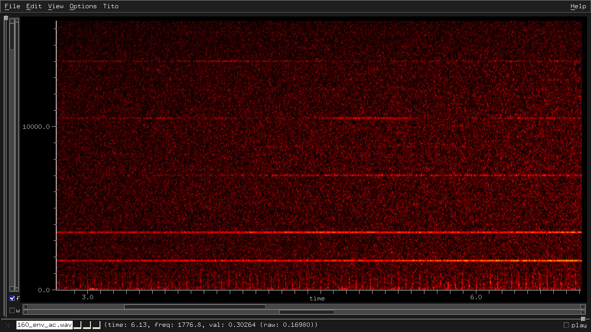

[Traduzione italiana](LEGGIMI.md)

# Analysis of an electromagnetic attack

I noticed the attack voice-to-skull the last year, July 15th 2017.

The artificial deficiency coordinates the sequences and the psychology
of the dialogues, often offensive, and the interferences to the normal
neural oscillations that disturb the sleep with tremors, convulsions, etc.

The following video shows a part of the signal directed to my head:


[head_945mhz.mp4 (View Raw)](https://raw.githubusercontent.com/titola/neuropa/master/media/head_945mhz.mp4)

[head_945mhz.mp4](https://github.com/titola/neuropa/blob/master/media/head_945mhz.mp4)

In Italy "The personal freedom is inviolable." [1]

My head is continually tracked, probably using the technology of the
deficient missiles.

The criminals use the radio without limits of frequency, disturbing
also the musical transmissions in FM.

There are at least four fixed positions of the attackers. The measures
have been taken in Rome (north), June 5th 2018, by using SDR, a simple
antenna and a digital compass.

-   NNE 20°
-   NNW 338°
-   between SW 227° and WSW 251°
-   between E 92° and SE 127°

I want to share the analysis of this attack to break the veil of
mystery, often ignorantly divulged by using the word "conspiracy".

I have analyzed the complete dynamics of the attack. This document
contains what I can unequivocally explain (20% of the overall attack
but I will write other and I will improve the structure of this
document). I am a simple musician and programmer.

The decoding is improvable (I have used a simple slope detector), but
if you hear a voice in the audio file

[cuba_attack_decoded.ogg (View Raw)](https://raw.githubusercontent.com/titola/neuropa/master/media/cuba_attack_decoded.ogg)

[cuba_attack_decoded.ogg](https://github.com/titola/neuropa/blob/master/media/cuba_attack_decoded.ogg)

also the [US embassy in Cuba](https://en.wikipedia.org/wiki/Embassy_attack_accusations_in_Cuba)
unconsciously suffered a similar offensive action, because what you
have just listened is hidden in a published recording [2]. Perhaps the
used signal was rectified by an anomalous Hall effect in some
ferromagnetic material [3]. Therefore the embassy workers have
accidentally listened to the result of an envelope follower.

## Table of Contents

- [Private signal](#private-signal)
- [Voice encoding](#voice-encoding)
- [Public signal](#public-signal)
- [Hypothesis about the US embassy attack in Cuba](#hypothesis-about-the-us-embassy-attack-in-cuba)
    - [Methods to get the voices from the audio recording](#methods-to-get-the-voices-from-the-audio-recording)
- [Other signals to analyse](#other-signals-to-analyse)
    - [Events synchronized with the voices](#events-synchronized-with-the-voices)
    - [Electric meters ACEA-ARETI](#electric-meters-acea-areti)
- [References](#references)

## Private signal

The sonogram of a recording of the signal, with center frequency of
945 MHz and sampling rate of 2 MHz, highlights the main pulses:


During the recording, the infamous criminals lower the level of the
voices and increase the noise. Recently, the level of the voices is
also very low if I don't record, however the intensity of the
induced [tinnitus](https://en.wikipedia.org/wiki/Tinnitus) is
unchanged.

A pulse "A" is the sum of 100 sinusoids separated by 1733 Hz, so the
bandwidth is 173.3 kHz.

A pulse "B" is the sum of 7 sinusoids separated by 216.6 Hz (= 1733/8).
The pattern of the the pulse repetition periods is

```
A A A A B A A A A B A A A A B ...

A = 0.0461 s = 80 / 1733  => 21.69 Hz
B = 0.0511 s = 75 / 1469  => 19.57 Hz
freq_average = 5 / ((A * 4) + B) = 21.23 Hz
```

I have simulated the tinnitus produced by that signal by approximating the
termo-acoustic demodulator described in the section "Voice encoding":

[tinnitus_pulses.wav (View Raw)](https://raw.githubusercontent.com/titola/neuropa/master/media/tinnitus_pulses.wav)

[tinnitus_pulses.wav](https://github.com/titola/neuropa/blob/master/media/tinnitus_pulses.wav)

I have preferred to use a source-filter model instead of synthesizing
the acoustic frequencies, therefore the thermoelastic wave is approximated
by a pulse train with pattern A-A-A-A-B and average frequency of 21.23 Hz
(the other pulses are excluded to simplify the model) filtered by the
conduction filter based on the figure 4 in [4]. This type of signal
interferes in particular way with the neural oscillations (the other
variable pulses can modulate specific brain waves with different rhythms)
before to reach the inner ear.

It is possible to compute the induced pressure amplitude by using the
formula and the amplitude factors of the figure 4 in [4]:

```
P(pulse_width) = A*abs(sin(pi*freq*pulse_width)) =

= 572*abs(sin(pi*7800/(216.625*7))) = 2.49e-4 Pa (about 22 dB SPL)
```

where 7800 Hz is the main acoustic frequency.

The following audio file contains an annoying interval of minor sixth
between the simulated tinnitus at 21.2 Hz and an oscillation around 35.4 Hz
(the listening requires decent headphones):

[tinnitus_plus_6min.wav (View Raw)](https://raw.githubusercontent.com/titola/neuropa/master/media/tinnitus_plus_6min.wav)

[tinnitus_plus_6min.wav](https://github.com/titola/neuropa/blob/master/media/tinnitus_plus_6min.wav)

The example of the minor sixth is not casual but inspired by
some audio recordings that capture low frequency sounds and
infrasounds. The next clip is amplified by 40 dB:


[low_freq_with_6min_for_tinnitus.wav](https://github.com/titola/neuropa/blob/master/media/low_freq_with_6min_for_tinnitus.wav)

The (protected) criminals use these sounds also to exploit the
interaction with the tinnitus. I will add a section for the nightly
audio recordings that contain the sounds produced through intentional
electromagnetic interferences: pulses repeated every 1.9 seconds,
a continuous signal with fundamental frequency of 7.62 Hz and other
frequencies that form simple ratios with 50 Hz, the nominal frequency
of the electrical grid in Italy [5], for example:

```
100 = 50 * 2
66.6 = 50 * 4/3
216.6 = 50 * 13/3
50 = 96 / [repetition period of the peaks] = 96 / 1.92
50 = 9 / [pulse duration] = 9 / 0.18

sporadic "scintillant" errors:
  5415 = 216.6 * 25
  1155 = 216.6 * 16/3
```

Finally, the part labeled "misc" in the first sonogram contains pulses
produced by the sum of sinusoids separated by 1469 Hz and other
sinusoids also separated by 1469 Hz.

## Voice encoding

The criminals use more techniques.

A simple recipe to get the pulses A is the following:

-   Sinusoidal signal with frequency 14.5 kHz, frequency modulated by a vocal sound.

-   Pulse generated each time the amplitude of the modulated signal goes from positive to negative.

The pulses are generated by the sum of sinusoids separated by the
frequencies that cause an unceasing resonant tinnitus in my head.

Any time the energy of a RF pulse is absorbed by the cerebral tissue,
the temperature rises of 5e-6 °C [6]. The rapid thermal expansion produces
a thermoelastic wave that travels to the inner ear. Therefore the
criminals use that thermo-acoustic demodulator to send vocal messages
to me through ultrasounds.

This information defuses the psychologic weapon because it cancels the
suggestive effect. The childish effect "play the entryphone and run
away" and the annoying side effects (to describe in a separate section)
persist.

## Public signal

Also my neighbors receive this type of signal:


It is nervous and tries to obscure its intentions. Often, it is
coupled with an attenuated imitation about 91.2 kHz apart.


On July 18th 2018, I have counted about 45 components of this type,
5 between 80 and 88 MHz and at least 40 between 120 and 170 MHz.

The autocorrelation of the envelope reveals the signature of the sender:
resonances multiple of about 1740 Hz and a pulse train with frequency of
about 18 Hz and bandwidth less than 1600 Hz.

Example: center frequency of 138 MHz


Example: center frequency of 160 MHz



Example: center frequency of 170 MHz


The energy of the pulses of over forty components is absorbed by the
cerebral tissue, therefore the threshold level necessary to produce
the thermoelastic wave is lower.

## Hypothesis about the US embassy attack in Cuba

The recording of what some US embassy workers heard in Havana has
characteristics similar to the signal at 945MHz that I receive in my
head. The main difference is the distance in frequency between the
sinusoids that generate the pulses. In my case:

-   Pulses with sinusoids separated by 216.6 Hz and pulse repetition periods with A-A-A-A-B (see above).

-   Pulses with sinusoids separated by 1733 Hz and variable pulse repetition period.

In the Cuban case, the sinusoids are always separated by 180 Hz but
the 21 Hz clock is the same.

The amplitudes of the following sonogram are in dB to highlight the
part filtered by the recorder or by the editor:


Instead, the next sonogram shows the clock in my head (linear amplitude)
under 1733 Hz, demodulated, under-sampled and recorded to a sound file:


There are two types of pulse:

-   Pulses with sinusoids separated by 180 Hz, bandwidth of 3960 Hz and pulse frequency of 21 Hz.

-   Pulses with sinusoids separated by 180 Hz and variable pulse repetition period.

### Methods to get the voices from the audio recording

-   FIR filter to select the content between 6 and 9 kHz.

-   Pitch 1 octave up (optional).

    ```
    # example
    rubberband -f2 in.wav out.wav
    ```

-   Slope detector.

    ```
    pseudo-code: env_follower(diff(input))
    ```

-   BP filter to select the content between 100Hz and 3.5kHz.

[cuba_attack_decoded.ogg (View Raw)](https://raw.githubusercontent.com/titola/neuropa/master/media/cuba_attack_decoded.ogg)

[cuba_attack_decoded.ogg](https://github.com/titola/neuropa/blob/master/media/cuba_attack_decoded.ogg)

Alternative method:

-   FIR filter to select the content between 6 and 9 kHz.

-   Convolution of a set of impulses with a FIR BP, fmin=100Hz and fmax=3kHz.

    ```
    # pseudo-code to generate the set of impulses

    d[n] = in[n] - in[n-1]
    if d[n] < 0 and d[n-1] >= 0
        then out[n] = in[n-1]
        else out[n] = 0
    endif
    ```

[cuba_attack_decoded_alt.ogg (View Raw)](https://raw.githubusercontent.com/titola/neuropa/master/media/cuba_attack_decoded_alt.ogg)

[cuba_attack_decoded_alt.ogg](https://github.com/titola/neuropa/blob/master/media/cuba_attack_decoded_alt.ogg)

## Other signals to analyse

### Events synchronized with the voices

This type of signal is synchronized with the voices:


Received at the frequencies 173.456 MHz, 173.880 MHz, 173.956 MHz and
460.557 MHz with bandwidth of 4 kHz.

The hook shaped curve remembers the PLHR (Power Line Harmonic Radiation)
induction lines described in the paper "On the nonlinear triggering of
VLF emissions by power line harmonic radiation" by D. Nunn, J. Manninen,
T. Turunen, V. Trakhtengerts and N. Erokhin.

A sinusoidal signal goes down from the maximum to the central
frequency and continues with duration between 0.072 and 0.076 seconds,
then it is amplitude modulated by a sinusoid of 2 kHz (mix of two side
sinusoids) for 0.034 seconds. The middle part is a kind of noise with
LTAS (Long-Term Average Spectrum) almost uniform in bandwidth:


The duration of the final sinusoidal signal is about 0.034 seconds.

The duration of the noisy part (maybe a cloud of sinusoidal gains)
depends on the perceived voice.

The following signal is similar but with duration of 0.178 seconds,
repeated every 1.92 seconds

```
# 96 cycles of the nominal frequency of the electrical grid
1.92 = 96 / 50

# 9 cycles
0.18 = 9 / 50
```

and without isolated sinusoidal signals:


Received at the frequencies 421.684 MHz (bw 5kHz instead of 4kHz) and
422.733 MHz (bw 3kHz instead of 4kHz).

Note the duration of 0.178 seconds and the repetition period of 1.92
seconds in the audio recordings that contain low frequency sounds
and infrasounds:


[low_freq_with_6min_for_tinnitus.wav](https://github.com/titola/neuropa/blob/master/media/low_freq_with_6min_for_tinnitus.wav)

I think the thugs monitor the peaks of the infrasounds repeated every
1.92 seconds also to take the variation of the nominal frequency to
tune the signals, for example the duration between 9/49 (0.183s) and
9/51 (0.176s).

The formula:

```
y = x^2 * sin(2 pi 1/0.178 t)
```

is a part of a possible transfer function to get the peaks of the
infrasound from the signal at 422.733 MHz:


The other signals are transformed at least (the formula is possibly
incomplete) in low frequency oscillations. I want to investigate the
microwave plasma in resonator mode, where the plasma density varies
with the wave magnitude.

Note: 421.684 MHz is not present in a recording on August 23th 2018,
and the bandwidth at 422.733 MHz becomes 5kHz. The comparison will be
useful to understand better the synthesis and the function of the low
frequency audio signal.

### Electric meters ACEA-ARETI

The electric meters of ACEA-ARETI have anttennas to communicate in RF
at the frequencies 169 and 868 MHz. These frequencies are multiple of
some frequencies used for the attack (see the previous section):

```
868 / 5 = 173.6
    => 173.4 and 173.7 MHz are synchronized to the voices.

169 * 5/2 = 422.5
    => 421.684 and 422.7 MHz are synchronized to the infrasounds.
```

From "Bilancio di Sostenibilità 2017 del Gruppo Acea", pag. 81:

> È stato poi avviato lo sviluppo di un concentratore multiservizio
> per i contatori elettronici di prima generazione adeguatamente
> reingegnerizzato, predisposto per l’acquisizione dei contatori di
> seconda generazione e per essere integrato con una terza unità
> per la comunicazione in RF a 169/868 MHz. Il nuovo concentratore
> multiservizio (CMS) è un apparato di tipo modulare costituito da
> un’unità centrale di controllo ed elaborazione e una o più unità
> aggiuntive ognuna dedicata a un servizio specifico (elettrico,
> idrico, ecc.). A fine dicembre 2017 è stato presentato il
> prototipo che sarà oggetto delle prove e dei collaudi nel corso
> della prima metà del 2018.

## References

[1] Costituzione della Repubblica Italiana, articolo 13.

[2] Josh Lederman and Michael Weissenstein. Dangerous sound?
What Americans heard in Cuba attacks. AP News, October 2017.

[3] Hang Chen, Xiaolong Fan, Hengan Zhou, Wenxi Wang, Y. S. Gui,
C.-M. Hu, and Desheng Xue. Spin rectification enabled by anomalous
Hall effect.

[4] N. M. Yitzhak, R. Ruppin, R. Hareuveny. Numerical Analysis of the
Microwave Auditory Effect.

[5] Coincidences: a three phase meter broken the last year during the
first attack and another electric meter unusable a few months ago
(pulled wires). Besides, if I switch off an electric meter, the intensity
of the body vibrations of the nightly tortures decreases.

[6] J.A. Elder and C.K. Chou. Auditory Response to Pulsed
Radiofrequency Energy.
