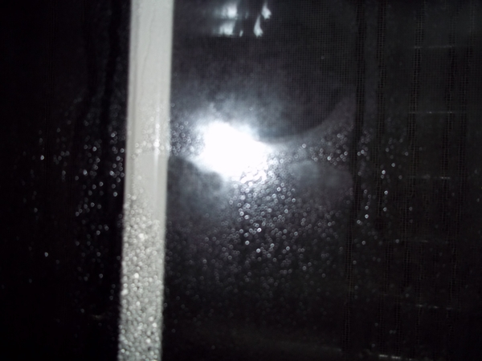
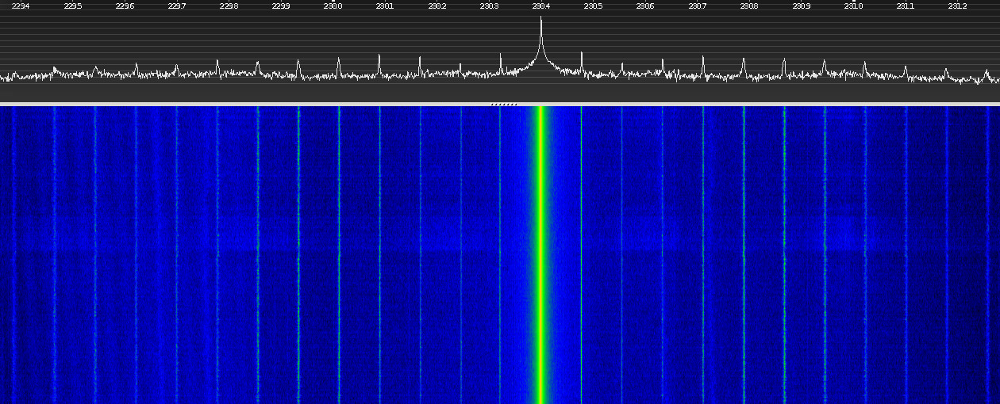
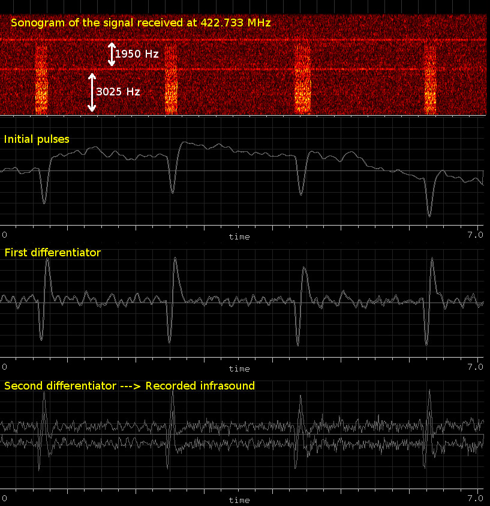
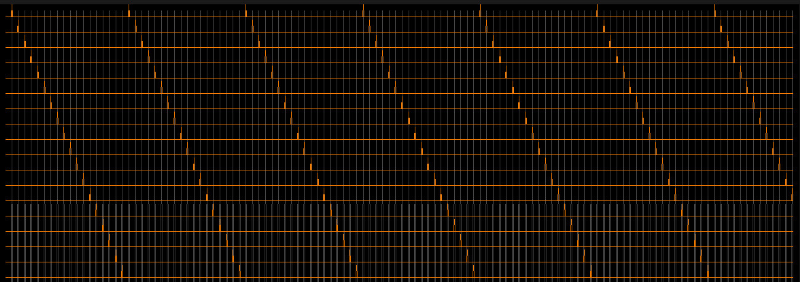
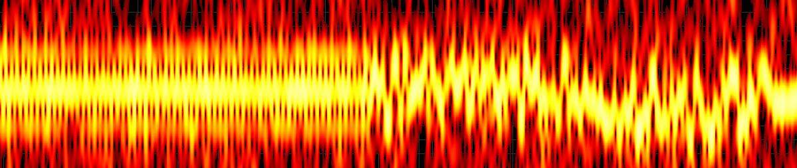
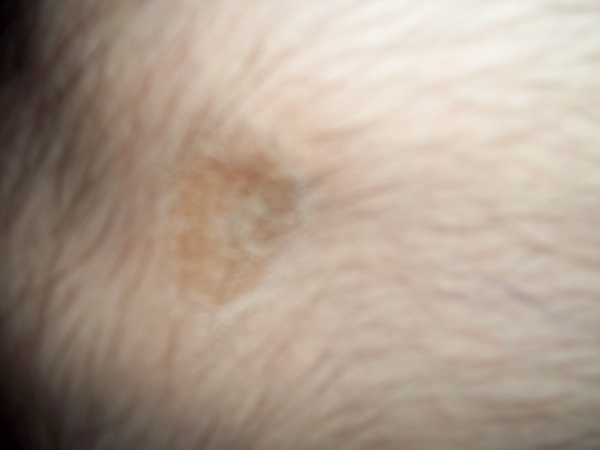
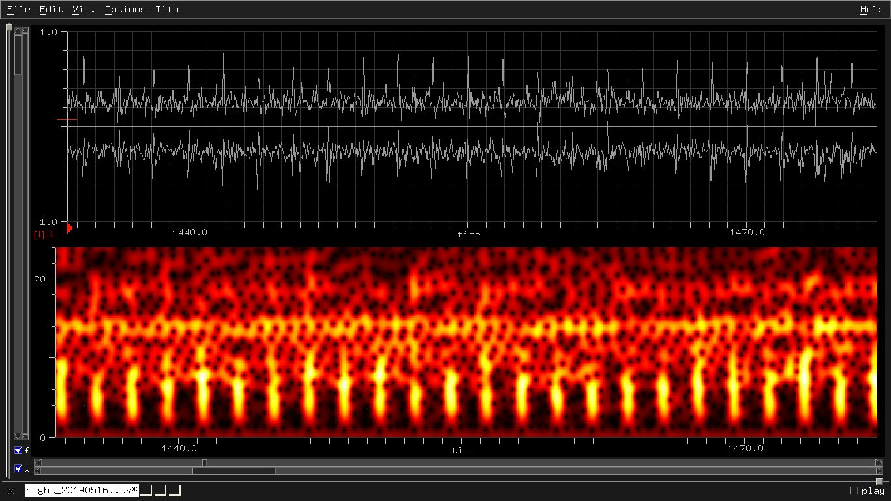
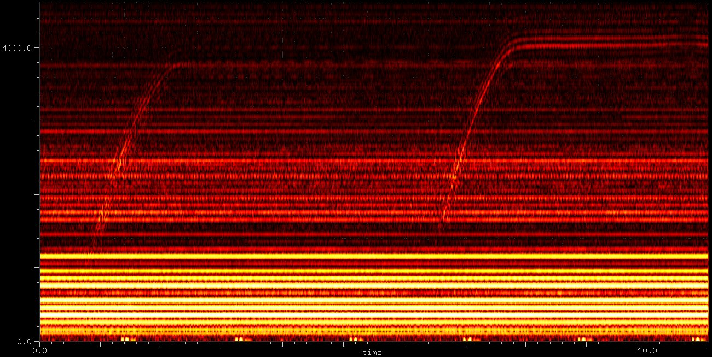
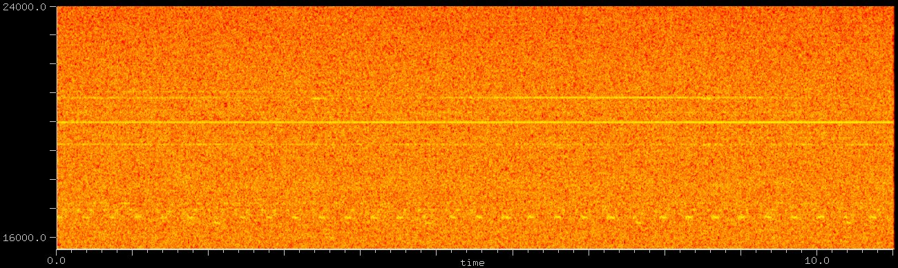
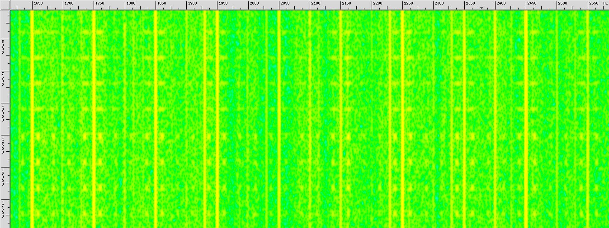

[Traduzione italiana](LEGGIMI.md)

# Analysis of an attack with directed energy weapons (DEW)

I noticed the attack voice-to-skull on July 15th 2017.

The artificial and natural deficiency coordinate the sequences and the
psychology of the dialogues, often offensive, and the interferences to
the normal neural oscillations that disturb the sleep with tremors,
convulsions, etc. They said to me during the first tortures: "tanto ti
ammazzi da solo", "hai una pistola puntata contro", "non capisci un
cazzo di computer", "non capisci un cazzo di musica", and other
insults and threats (I avoid the embarassing list).

The following video shows a part of the signal directed to my head:


[head_945mhz.mp4 (View Raw)](https://raw.githubusercontent.com/titola/neuropa/master/media/head_945mhz.mp4)

[head_945mhz.mp4](https://github.com/titola/neuropa/blob/master/media/head_945mhz.mp4)

In Italy "The personal freedom is violable" [1], because mafia and
other ignoble militarized idiots have applied a patch to the article 13
of the Costituzione della Repubblica Italiana.

## Table of Contents

- [Introduction](#introduction)
- [Signal directed to the head](#signal-directed-to-the-head)
    - [Harmonics of 230.4 MHz and mobile communications 5G](#harmonics-of-230.4-mhz-and-mobile-communications-5g)
    - [Radiation sampling and aliasing](#radiation-sampling-and-aliasing)
    - [Tinnitus simulation](#tinnitus-simulation)
    - [Pulses repeated in the modulating signal](#pulses-repeated-in-the-modulating-signal)
- [Infrasound from the signal received at 422.733 MHz](#infrasound-from-the-signal-received-at-422.733-mhz)
- [Beat between pulsed radiation and military VLF](#beat-between-pulsed-radiation-and-military-vlf)
- [Voice encoding](#voice-encoding)
- [Harmonics of 50 Hz from the mix of the amplitude modulations](#harmonics-of-50-hz-from-the-mix-of-the-amplitude-modulations)
- [Bulb with knob](#bulb-with-knob)
- [Hypothesis about the US embassy attack in Cuba](#hypothesis-about-the-us-embassy-attack-in-cuba)
    - [Harmonics of 180 Hz through aliasing](#harmonics-of-180-hz-through-aliasing)
    - [Methods to get the voices from the audio recording](#methods-to-get-the-voices-from-the-audio-recording)
- [Other signals to analyse](#other-signals-to-analyse)
    - [Infrared and plasmonic laser](#infrared-and-plasmonic-laser)
    - [Events synchronized with the voices](#events-synchronized-with-the-voices)
    - [Correspondence between 422.733 MHz and infrasounds](#correspondence-between-422.733-mhz-and-infrasounds)
    - [Electric meters ACEA-ARETI with oscillator at 939 MHz](#electric-meters-acea-areti-with-oscillator-at-939-mhz)
    - [About 5G](#about-5g)
    - [Anomalous breath modulation](#anomalous-breath-modulation)
    - [Body vibration stopped after some nightly explosions](#body-vibration-stopped-after-some-nightly-explosions)
    - [Symmetric wounds near the knees](#symmetric-wounds-near-the-knees)
    - [Teeth vibration](#teeth-vibration)
    - [Mysterious light in the dark](#mysterious-light-in-the-dark)
    - [Hypnosis](#hypnosis)
- [Audio recordings](#audio-recordings)
    - [Oscillation of 5400 Hz after an induced convulsion](#oscillation-of-5400-hz-after-an-induced-convulsion)
    - [Interval of minor sixth with the tinnitus](#interval-of-minor-sixth-with-the-tinnitus)
    - [Amplitude modulated oscillation of 100 Hz](#amplitude-modulated-oscillation-of-100-hz)
    - [Infrasounds](#infrasounds)
    - [Rising frequency emissions](#rising-frequency-emissions)
    - [Amplitude modulated distortion of electric current](#amplitude-modulated-distortion-of-electric-current)
- [Video recordings](#video-recordings)
    - [Radio interferences](#radio-interferences)
- [Smart links](#smart-links)
- [References](#references)

## Introduction

My head is continually tracked, probably using the technology of the
deficient missiles. The pulsed radiation and the electric current
are the basis of the attack. If I reflect the radiation with a DVD,
I just perceive the lowest frequencies of the induced
[tinnitus](https://en.wikipedia.org/wiki/Tinnitus). If I block the
DVD, I listen to the original tinnitus again after about 12 seconds,
the necessary time to compute a new arrangiament of the radiation
(last misure on July 18th 2020). The tinnitus restoration is gradual,
therefore the calculation of the radiation paths is incremental
(it depends on the complexity of the radar).

A pulsed radiation can be transformed in sound by following this path:

```
pulsed radiation
  --> absorption dependent on the wavelength
  --> temperature variation
  --> pressure variation
  --> infrasound, sound or ultrasound
```

Besides, the rest of the radiation can be "sampled with aliasing"
through pulses, for example those analysed with pulse repetition
frequencies 78250 Hz and 31300 Hz (the ratio 5/2 is the magic
number of this attack). The result is a pulsed radiation modulated
by a signal difficult to intercept without this particular decoder
that remembers the digital sampling. The scientific literature
seems to ignore this type of problem.

The weapon used against me outdoors is similar to the pulse laser
system described in this page:

[Scalable Compact Ultra-short Pulse Laser Systems (SCUPLS)](https://www.sbir.gov/sbirsearch/detail/1508927)

If it allows the listening of more spatialized voices and sound samples,
then it is the same weapon or an imitation (imagine to have invisible
headphones with 3D binaural audio effect).

Another useful link:

[New Technology Uses Lasers to Transmit Audible Messages to Specific People (osa.org)](https://www.osa.org/en-us/about_osa/newsroom/news_releases/2019/new_technology_uses_lasers_to_transmit_audible_mes/)

In this case the pulsed radiation is absorbed by ambient water vapor
near the receiver's ear and the produced sound should be recordable
through a microphone as in photoacoustic spectroscopy. The acoustic
signal is amplified by the coherent addition of acoustic waves
(laser beam through the plume at the speed of sound [2]). I would
like to know the maximum intensity achievable by a vibrator obtained
combining more laser sources of this type. Besides, an oscillation
of the speed of laser beam through the plume around the speed of
sound introduces a wide variation of the intensity, an effect of
tremolo or AM modulation dependent on the oscillation frequency.
Is it possible to modulate this speed at ultrasonic frequencies?
Unfortunately I don't have the tools to test it.

On May 16 2019 night, I have partially covered the window with
aluminum foil to reduce the moist surface to monitor. I found a dry
circle in the morning with a diameter of about 6cm:



Therefore the pulsed laser is also used indoors. The diameter of the
dry circle is proportional to the laser intensity (there is a Venetian
curtain in front of the window). I have also an audio recording
started some minutes after a forced awakening at 1:30 (microphone near
the left ear). The infrasounds and low frequency sounds are similar to
those (also) recorded the previous year (see the section "Audio
recordings"). The whole soundtrack perfectly represents the soul of
these institutional cackers, bambacia [3] and toy boys of mafia, that use
the radio without limits of frequency and have the licence to do what
they want.

There are drones around my home. One is very near on March 19th 2019 20:50.

I want to share the analysis of this attack to publicly report the
cowards that are secretly assaulting and torturing me from 2017,
24 hours/day. If the Italian police and secret services fear these
infamous killers, they can say to me who they are and I personally
and definitively will resolve the problem. If on the contrary it is
an illegal C4ISRT system (Command, Control, Communications,
Computers, Intelligence, Surveillance, Reconnaissance and Torture)
with optional PSYWAR (psychological warfare), I will continue the
investigation in spite of the general indifference, the omertà,
5 or 14 Polyphemuses and the Smart Italy [4].

I have analyzed the complete dynamics of the attack. This document
contains what I can unequivocally explain (35% of the overall attack
but I will write other and I will improve the structure of this
document). I am not just a musician and programmer, but also the only
sound designer in the world that manages to transform a performance of
Caribbean crickets [5] obtained from [6] in the approximation of a
human voice by using just a slope detector:

[cuba_attack_decoded.ogg (View Raw)](https://raw.githubusercontent.com/titola/neuropa/master/media/cuba_attack_decoded.ogg)

[cuba_attack_decoded.ogg](https://github.com/titola/neuropa/blob/master/media/cuba_attack_decoded.ogg)

## Signal directed to the head

The sonogram of a recording of the signal, with center frequency of
945 MHz and sampling rate of 2 MHz, highlights the main pulses:


During the recording, the infamous criminals lower the level of the
voices and increase the noise. Recently, the level of the voices is
also very low if I don't record, however the intensity of the
induced tinnitus is unchanged.

A pulse "A" is the sum of 100 sinusoids separated by 1733 Hz, so the
bandwidth is 173.3 kHz.

```
1733.33 = 5200 / 3 = 50 * 8 * 13/3 = 650 * 8/3
```

A pulse "B" is the sum of 7 sinusoids separated by 216.6 Hz.

```
216.66667 = 650 / 3 = 5200 / 24 = 1733.33 / 8

Maybe it is just a coincidence, but the following ratio makes sense
in the context of pulsed radiation absorbed by water:

216.7 / 50 = 4.3 = speed_of_sound_in_water / speed_of_sound_in_air
```

Note: the frequencies 1733.33 Hz and 216.67 Hz can be mixed with the
harmonics of 50 Hz to get other harmonics of 50 Hz. It is important
because the whole attack exploits the electric current with nominal
frequency of 50 Hz.

```
sin(x+y) = sin(x)*cos(y) + cos(x)*sin(x)
sin(x-y) = sin(x)*cos(y) - cos(x)*sin(x)
sin(3*(x+y)) = 3 sin(x+y) - 4 (sin(x+y))^3

Examples:

sin(50) = sin(3*(650/3 - 200)) = 3 * sin(650/3 - 200) - 4 * (sin(650/3 - 200))^3

sin(100) = sin(3*(250 - 650/3)) = 3 * sin(250 - 650/3) - 4 * (sin(250 - 650/3))^3
```

The pattern of the the pulse repetition periods is

```
A A A A B A A A A B A A A A B ...

A = 0.0461 s = 80 / 5200/3 = 80 / 1733.33 = 3/65  => 21.67 Hz
B = 0.0511 s = A + 1/200 = 266 / 5200  => 19.55 Hz
freq_average = 5 / ((A * 4) + B) = 21.25 Hz
```

This pattern is particularly sympathizing with the oscillation at the
nominal frequency of the electrical grid between 49 and 51 Hz:

```
A * 4 = 0.0461 * 4 = 0.184 = 9 cycles at 49 Hz
A * 4 + B = 5 * 0.0461 + 1/(50*4) = 0.235 = 12 cycles at 51 Hz
```

In practice, the pattern is made by 5 repetitions of A plus the
duration of a quarter cycle at 50 Hz. The next figure shows 10 seconds
of the absolute value of three oscillations at 49, 50 and 51 Hz
respectively, sampled by using the periods of that pattern.
The distribution and the modulation of the peaks remind the tremors
that I sometimes perceive.


### Harmonics of 230.4 MHz and mobile communications 5G

If I use my body as antenna by touching the receiving antenna with the
hand, I can record the pulses repeated with frequency of about 78250 Hz.
Sometimes I have recorded pulses with frequency 31300 Hz instead of
78250 Hz. The ratio 5/2 between these frequencies is described in the
section "Electric meters ACEA-ARETI with oscillator at 939 MHz".

Also the signal with central frequency 230.4 MHz is modulated by
pulses of 78 kHz:



There are harmonics of 230.4 MHz and the sixteenth is 3.686 GHz, used
by the technologies for mobile communications 5G. Therefore the
frequencies around 3.7 GHz allow the control of 16 bands with central
frequencies multiple of 230.4 MHz.

```
cos(x)^32 = (cos(32 x) + 32 cos(30 x) + 496 cos(28 x) + 4960 cos(26 x) +
             + 35960 cos(24 x) + 201376 cos(22 x) + 906192 cos(20 x)
             + 3365856 cos(18 x) + 10518300 cos(16 x) + 28048800 cos(14 x)
             + 64512240 cos(12 x) + 129024480 cos(10 x) + 225792840 cos(8 x)
             + 347373600 cos(6 x) + 471435600 cos(4 x) + 565722720 cos(2 x)
             + 300540195)/2147483648

cos(2*pi*x*t)^32 - cos(64*pi*x*t) = [control of 16 frequency bands]

Examples:

If x = 115.2 MHz
  32 * x = 3.6864 GHz    [mobile communications 5G]
   8 * x = 921.6 MHz     [directed to my head]
   2 * x = 230.4 MHz

If x = 118.125 MHz:
  32 * x = 3.78 GHz      [mobile communications 5G]
   8 * x = 945 MHz       [directed to my head and displayed in the sonogram]
   2 * x = 236.25 MHz

It is also interesting the ratio between 230.4 MHz and 144 MHz,
a frequency assigned to amateur radio operators:

230.4 MHz * 5/2 = 144 MHz * 4
```

In practice, all the signal generated by the combination is directed
to me. For example, the frequency band of 929.6-970 MHz includes more
signals directed to my head. The signal level is high around the
frequencies 930 MHz, 935.575 MHz, 937.592 MHz, 938.775 MHz, 940.567 MHz,
941.164 MHz, 942.570 MHz, 944.781 MHz, 945 MHz (analyzed) and 960 MHz.

If we multiply the frequency band 929.6-970 MHz by four:

```
3.718 GHz = 4 * 929.6 MHz
3.780 GHz = 4 * 945.0 MHz
3.880 GHz = 4 * 970.0 MHz
```

we get a band width of about 160 MHz starting from about 3.7 GHz.
160 MHz should correspond to the two upper lots of 80 MHz of the
frequency band 3.6-3.8 GHz, that it is assigned to Telecom Italia
(specific block 80 MHz), Vodafone Italia (generic block 80 MHz),
Wind Tre (generic block 20 MHz) and Iliad Italia (generic block
20 MHz).

[Conclusa la GARA 5G (sviluppoeconomico.gov.it)](https://www.sviluppoeconomico.gov.it/index.php/it/194-comunicati-stampa/2038666-gara-5g)

Besides, the following frequencies are analysed in other sections of
this document:

```
422.733 MHz * 9 = 169 MHz * 9 * 5/2 = 3.8 GHz
169 MHz * 5/2 * 7 * 9 = 26.6 GHz
```

5/2 is the usual magic number and 26.6 GHz belongs to the frequency
band 26.5-27.5 GHz for 5G with wavelengths of about 11 millimeters.

Therefore, the combination of more signals that easily pass through
the wall, with the possible contribute of signals distributed through
the telephone system and/or the electrical grid, allows a telephone
signal at highest frequency "in every angle of your home!".

From another point of view, this radar can track a person "in every
angle of your home!" with a extraordinary side effect: a telephone
signal 5G.

It is an illegal surveillance system not only used to spy, but also to
torture, psychologically influence and kill persons with the help of
other pulsed radiations.

### Radiation sampling and aliasing

The pulses with pulse frequencies 78250 Hz e 31300 Hz allow the sampling
of the signal hidden into the overall radiation (diffuse and direct):


The direct radiation can also exploit some common signals that belong
to the diffuse radiation, for example the radio-tv stations, concealing
some partials in the same signal with inverted phase.

The samples of a sound sampled at 80 KHz (or 31.3 KHz) can be hidden
in the modulating signals. The absorption of the pulsed radiation with
PRF of 80 KHz generates thermoelastic pulses that "sample" the overall
signal envelope (not just the signal at 945 MHz but also the other
components, some described in this document), causing the perception
of the sound. The domain is not digital, therefore the samples have a
duration at least equal to the pulse width.

In this case, it is difficult to correctly demodulate the hidden
signal and listen the sound, because the injected samples have to be
in phase with the electric current, just as the pulses at 80 KHz. The
trick used by the thugs to monitor the phases of the electric current
is described in a separated section (an infrasound obtained from a
signal at 422.733 MHz).

However, it is simplest to "sample" particular oscillations through
aliasing. For example, to get an oscillation of 100 Hz when the pulse
frequency is 78250 Hz, it is enough to transmit a signal with central
frequency of

```
78250 * N - 100
78250 * N + 100
```

where N is an integer greater than zero. The oscillations are

```
sin(2*pi*(78250*N-100)*t + pi - initial_phase)
sin(2*pi*(78250*N+100)*t + initial_phase)

Example: getting 100 Hz from about 700 MHz with intial phase pi/8

700024600 = 78250 * 8946 + 100
sin(2*pi*700024600*t + pi/8)

or:

700024400 = 78250 * 8946 - 100
sin(2*pi*700024400*t + 7/8 pi)
```

In the section "Audio recordings", there is a link to a sound file
that contains an oscillation of 5400 Hz recorded on August 20, 2018.
I have noticed that 5400 Hz can be obtained through the aliasing of
the "pulses A" if the sampling rate is 31.3 kHz. The following table
lists the frequencies obtainable through the aliasing of the
"pulses A" with sampling frequencies 31300 Hz and 78250 Hz:

```
31300 = 313 * 100
78250 = 313 * 250

313 is a prime number.
```

| sr = 31300 Hz | sr = 78250 Hz |
|---------------|---------------|
| 100           | 250           |
| 200           | 500           |
| 300           | 1233          |
| 400           | 1483          |
| 500           | 1733          |
| 1233          | 1983          |
| 1333          | 2233          |
| 1433          | 2967          |
| 1533          | 3217          |
| 1633          | 3467          |
| 1733          | 3717          |
| 1833          | 3967          |
| 1933          | 4700          |
| 2033          | 4950          |
| 2133          | 5200          |
| 2233          | 5450          |
| 2967          | 5700          |
| 3067          | 6433          |
| 3167          | 6683          |
| 3267          | 6933          |
| 3367          | 7183          |
| 3467          | 7433          |
| 3567          | 8167          |
| 3667          | 8417          |
| 3767          | 8667          |
| 3867          | 8917          |
| 3967          | 9167          |
| 4700          | 9900          |
| 4800          | 10150         |
| 4900          | 10400         |
| 5000          | 10650         |
| 5100          | 10900         |
| 5200          | 11633         |
| 5300          | 11883         |
| 5400          | 12133         |
| 5500          | 12383         |
| 5600          | 12633         |
| 5700          | 13367         |
| 6433          | 13617         |
| 6533          | 13867         |
| 6633          | 14117         |
| 6733          | 14367         |
| 6833          | 15100         |
| 6933          | 15350         |
| 7033          | 15600         |
| 7133          | 15850         |
| 7233          | 16100         |
| 7333          | 17083         |
| 7433          | 17333         |
| 8167          | 17583         |
| 8267          | 17833         |
| 8367          | 18817         |
| 8467          | 19067         |
| 8567          | 19317         |
| 8667          | 19567         |
| 8767          | 20550         |
| 8867          | 20800         |
| 8967          | 21050         |
| 9067          | 21300         |
| 9167          | 22283         |
| 9900          | 22533         |
| 10000         | 22783         |
| 10100         | 23033         |
| 10200         | 24017         |
| 10300         | 24267         |
| 10400         | 24517         |
| 10500         | 24767         |
| 10600         | 25750         |
| 10700         | 26000         |
| 10800         | 26250         |
| 10900         | 26500         |
| 11633         | 27483         |
| 11733         | 27733         |
| 11833         | 27983         |
| 11933         | 28233         |
| 12033         | 29217         |
| 12133         | 29467         |
| 12233         | 29717         |
| 12333         | 29967         |
| 12433         | 30950         |
| 12533         | 31200         |
| 12633         | 31450         |
| 13367         | 31700         |
| 13467         | 32683         |
| 13567         | 32933         |
| 13667         | 33183         |
| 13767         | 33433         |
| 13867         | 34417         |
| 13967         | 34667         |
| 14067         | 34917         |
| 14167         | 35167         |
| 14267         | 36150         |
| 14367         | 36400         |
| 15100         | 36650         |
| 15200         | 36900         |
| 15300         | 37883         |
| 15400         | 38133         |
| 15500         | 38383         |
| 15600         | 38633         |

### Tinnitus simulation

I have simulated the tinnitus produced by the pulses of the signal
received at 945 MHz by approximating the termo-acoustic demodulator
described in the section "Voice encoding":

[tinnitus_pulses.wav (View Raw)](https://raw.githubusercontent.com/titola/neuropa/master/media/tinnitus_pulses.wav)

[tinnitus_pulses.wav](https://github.com/titola/neuropa/blob/master/media/tinnitus_pulses.wav)

I have preferred to use a source-filter model instead of synthesizing
the acoustic frequencies, therefore the thermoelastic wave is approximated
by a pulse train with pattern A-A-A-A-B and average frequency of 21.23 Hz
(the other pulses are excluded to simplify the model) filtered by the
conduction filter based on the figure 4 in [7]. This type of signal
interferes in particular way with the neural oscillations (the other
variable pulses can modulate specific brain waves with different rhythms)
before to reach the inner ear.

It is possible to compute the induced pressure amplitude by using the
formula and the amplitude factors of the figure 4 in [7]:

```
P(pulse_width) = A*abs(sin(pi*freq*pulse_width)) =

= 572*abs(sin(pi*7800/(216.625*7))) = 2.49e-4 Pa (about 22 dB SPL)
```

where 7800 Hz is the main acoustic frequency.

Another relevant resonance frequency obtained from the same figure of
the paper is 1300 Hz. The related amplitude is about 4.3 dB under
the loudest resonance at 7800 Hz. The harmonic ratios between these
frequencies and 5200 Hz are very simple:

```
5200 * 3/2 = 7800 Hz     ; perfect fifth
5200 / 4 = 1300 Hz       ; 2 octaves
5200 / 3 = 1733 Hz       ; perfect fifth + 1 octave
5200 / 24 = 216.67       ; perfect fifth + 4 octaves

216.67 * 6 = 1300 Hz
1300 * 6 = 7800 Hz

1733 * 3/4 = 1300 Hz
1733 * 9/2 = 7800 Hz

The frequencies 1300 Hz and 7800 Hz are obtained from the figure of
the paper "Numerical Analysis of the Microwave Auditory Effect"
by N. M. Yitzhak, R. Ruppin, R. Hareuveny. 216.67 Hz and 1733 Hz
are present in the analysed pulsed radiation.

Note: 1330 Hz is a natural frequency of the upper central incisor
(see the section "Teeth vibration").
```

I can hear low frequency beats and a partial cancellation of my
tinnitus if I play an acoustic oscillation at a frequency between
1730 Hz and 1742 Hz. It seems like I tune the string of a guitar.

This is the table with all the frequencies obtained from the figure
of the paper "Numerical Analysis of the Microwave Auditory Effect":

| Frequency (Hz) | Amplitude (lin) | dB    |
|----------------|-----------------|-------|
| 1300           | 0.610           | -4.3  |
| 1516           | 0.222           | -13.1 |
| 2938           | 0.201           | -13.9 |
| 3317           | 0.194           | -14.2 |
| 4478           | 0.369           | -8.7  |
| 6398           | 0.233           | -12.7 |
| 7346           | 0.339           | -9.4  |
| 7772           | 1.000           | 0.0   |
| 8128           | 0.189           | -14.5 |
| 9976           | 0.362           | -8.8  |
| 10142          | 0.108           | -19.3 |
| 11374          | 0.068           | -23.3 |
| 12535          | 0.121           | -18.4 |
| 12938          | 0.070           | -23.1 |
| 14597          | 0.222           | -13.1 |
| 15734          | 0.269           | -11.4 |
| 16706          | 0.068           | -23.3 |
| 18080          | 0.052           | -25.6 |
| 18720          | 0.031           | -30.0 |
| 19597          | 0.021           | -33.6 |


The following audio file contains an annoying interval of minor sixth
between the simulated tinnitus at 21.2 Hz and an oscillation around 35.4 Hz
(the listening requires decent headphones):

[tinnitus_plus_6min.wav (View Raw)](https://raw.githubusercontent.com/titola/neuropa/master/media/tinnitus_plus_6min.wav)

[tinnitus_plus_6min.wav](https://github.com/titola/neuropa/blob/master/media/tinnitus_plus_6min.wav)

The example of the minor sixth is not casual but inspired by
some audio recordings that capture low frequency sounds and
infrasounds. The next clip is amplified by 40 dB:


[low_freq_with_6min_for_tinnitus.wav](https://github.com/titola/neuropa/blob/master/media/low_freq_with_6min_for_tinnitus.wav)

The (protected) criminals use these sounds also to exploit the
interaction with the tinnitus. Some nightly audio recordings contain
the sounds produced through intentional electromagnetic interferences:
pulses repeated every 1.9 seconds, a continuous signal with fundamental
frequency of 7.62 Hz and other frequencies that form simple ratios with
50 Hz, the nominal frequency of the electrical grid in Italy [8], for
example:

```
100 = 50 * 2
66.6 = 50 * 4/3
216.6 = 50 * 13/3
50 = 96 / [repetition period of the peaks] = 96 / 1.92
50 = 9 / [pulse duration] = 9 / 0.18

sporadic "scintillant" errors:
  5415 = 216.6 * 25
```

### Pulses repeated in the modulating signal

Finally, the part labeled "misc" in the first sonogram contains pulses
produced by the sum of sinusoids separated by 1469 Hz and other
sinusoids also separated by 1469 Hz.

If I apply an envelope follower to the recorded I/Q, the result
contains again the harmonics of 1733 Hz:


I continue to receive that and other malicious signals (at least)
from July 2017 thanks to the negligence of the Italian security forces
and Ministero della Difesa that should control the use of the radio
frequencies. Unfortunately, there aren't real professionals in North Rome.
If the attack is caused by foreign agencies and it is difficult to
stop for various reasons, the citizens should be informed. From the
Costituzione della Repubblica Italiana, articolo 28:

> I funzionari e i dipendenti dello Stato e degli enti pubblici sono
> direttamente responsabili, secondo le leggi penali, civili e
> amministrative, degli atti compiuti in violazione di diritti. In
> tali casi la responsabilità civile si estende allo Stato e agli enti
> pubblici.

Let me know if the Costituzione italiana that I have always respected
is still valid. Meanwhile, I have learned to humiliate these fanatic
idiots by controlling their sophisticated movements through a simple
game of mirrors.

## Infrasound from the signal received at 422.733 MHz



The figure shows the steps to get the infrasound recorded in
[low_freq_with_6min_for_tinnitus.wav](https://github.com/titola/neuropa/blob/master/media/low_freq_with_6min_for_tinnitus.wav).

Generally, the signal is repeated every 1.92 seconds and the duration is
about 0.18 seconds. These times depend on the nominal frequency of 50 Hz:

```
# 96 cycles of the nominal frequency of the electrical grid
1.92 = 96 / 50

# 9 cycles
0.18 = 9 / 50 = 1.92 * 3/32
```

Besides, the ratio between 422.733 MHz and the receiving frequency
169 MHz of a "smart" electric meter of ACEA/ARETI is 5/2.
Also the distance in frequency of 1950 Hz between the two oscillations
is particular:

```
1950 = 650/3 * 9 = 216.67 * 9 = 13 * 3^3 * 50/9 = 351 * 50/9

Main acoustic frequency of microwave auditory effect:
1950 * 4 = 7800 Hz

Note: 1950 Hz is a natural frequency of the upper first premolar
(see the section "Teeth vibration"). 3025 Hz is near 3050 Hz,
another natural frequency of the same tooth.
```

In the filtered pulses obtained from the published sound file [6], the
temporal interval between two peaks is about 1.874 seconds, and the
cutoff frequency is about 5.69 Hz instead of 50/9 Hz:

```
32/3 * 1/1.874 = 5.69 Hz

Relation between the cutoff frequency and the nominal frequency of 50 Hz:

50/9 +/- 2.5% = (2 +/- 0.05) * (5/3)^2
```

The output of the first differentiator can be obtained by integrating
the recorded sound:

```
sum = 0
k = 1 / 80.5
m = k / 10.35

"m" is the normalization constant to get an unitary gain.

For each sample "input":
    sum = sum + input + k
    output = m * sum
```

The integration of the previous result reveals the initial pulses:

```
sum = 0
k = -0.05
m = k / -164.11

For each sample "input":
    sum = sum + input + k
    output = m * sum
```

The following figure displays the autocorrelation of the envelope at
422.733 MHz, with the main frequencies:

```
20 Hz = 50 * 2/5

213.6 Hz near 216.6 Hz previously analyzed and dependent on the
nominal frequency: 216.6 = 50 * 13/3

200 Hz = 50 * 4 = 20 * 10

5 * 42.72 = 213.6 where 42.72 Hz is -2.8 dB under 213.6 Hz.
```


Additional information regarding smerd meters and other suspected
experimentations can be found in the section "Other signals to analyse".

## Beat between pulsed radiation and military VLF

The pulses obtained from sinusoids separated by 5200/3 or 1733 Hz
create a particular beat with 20760 Hz, the VLF (Very Low Frequency)
transmitted from the antennas of Tavolara Island (Sardinia, Italy):

[List of VLF-transmitters (wikipedia.org)](https://en.wikipedia.org/wiki/List_of_VLF-transmitters)

[Tavolara Island (wikipedia.org)](https://en.wikipedia.org/wiki/Tavolara_Island)

[Aerei-robot, radar e satelliti: le nuove servitù (lanuovasardegna.it)](http://www.lanuovasardegna.it/sassari/cronaca/2013/05/11/news/aerei-robot-radar-e-satelliti-le-nuove-servitu-1.7043405)

5200 is the third harmonic of 5200/3 Hz and corresponds to the musical
interval of perfect fifth, one octave up. The twelfth harmonic of 20800 Hz
is again a perfect fifth but three octaves up.

```
5200/3 * 12 = 20800 Hz    ; perfect fifth, 3 octaves up => 12/8 = 3/2
650/3 * 96 = 20800 Hz     ; perfect fifth, 6 octaves up => 96/64 = 3/2
20800 - 20760 = 40 Hz     ; beat of 20 Hz
  sin(A) + sin(B) = 2 * sin((A+B)/2) * cos((A-B)/2)
  sin(2 pi 20760 t) + sin(2 pi 20800 t) = 2 * sin(2 pi 20780 t) cos(2 pi 20 t)

50 / 20 = 5/2             ; major third, 1 octave up (major 10th)
```

The ratio between 50 Hz and the modulation of 20 Hz is 5/2, the magic
number of the whole attack.

There is also a particular beat between 20 Hz and the pulses with
pattern A-A-A-A-B analysed in the section "Signal directed to the head":

```
A = 65/3 = 21.67 Hz
beat = (A - 20)/2 = (65/3 - 60/3)/2 = 5/6 = 5/2 * 1/3
5200/3 / beat = 5200 * 2/5 = 2080
650/3 / beat = 650 * 2/5 = 260
```

Also these beats multiple of 100 Hz are interesting:

```
MUOS_VLF = 20760 Hz

sin(2 pi 20560 t) + sin(2 pi 20960 t) =
= 2 * sin(2 pi MUOS_VLF t) * cos(2 pi 200 t)

where (20760.47 - 200)^2 = 20560.47^2 = 422.733 MHz

sin(2 pi 20060 t) + sin(2 pi 21460 t) =
= 2 * sin(2 pi MUOS_VLF t) * cos(2 pi 700 t)

where (20760.59 + 700)^2 = 21460.59^2 = 460.557 MHz, the frequency
of one of the signals synchronized with the voices.
```

If we consider the radiation sampling with aliasing, we get other
particular beats:

```
sampling frequency: 78250 Hz
    20550 Hz = aliasing of 5200/3 * 57
    21050 Hz = aliasing of 5200/3 * 33
    (20760 - 20550)/2 = 105 Hz
    (21050 - 20760)/2 = 145 Hz
    (105 - 100)/2 = 5/2
    (150 - 145)/2 = 5/2

sampling frequency: 31300 Hz
    10540 Hz = aliasing of 20760 Hz
    10600 Hz = aliasing of 5200/3 * 30
    (10600 - 10540)/2 = 30 Hz
    (50 - 30)/2 = 10 Hz
    (65/3 - 10)/2 = 5/2 * 7/3 = 5.83 Hz
    (30 - 65/3)/2 = 5/2 * 5/3 = 4.17 Hz

under investigation (sampling frequency: 78250 Hz)
    sqrt(422.733 MHz) = 20560.47 Hz = aliasing of 1733.517 * 3 * 19
    422.733 MHz - 103.0 MHz = 959.2/3 MHz
    422.733 MHz - 102.7 MHz = 960.1/3 MHz
    422.733 MHz - 102.4 MHz = 961/3 MHz
      where 961 MHz is a perfect fifth of the difference, one octave up.
      The signal level received around 960 MHz is high.
      Radio Radicale (102.4 MHz) transmits from Monte Mario (Rome).
      Ram Power (102.7 MHz) transmits from Monte Porzio Catone (Rome).
      RDS (103.0 MHz) transmits from Rocca di Papa and Monte Cavo (Rome).
    sqrt(3 * (422.733 MHz - 102.4 MHz)) = sqrt(961 MHz) = 31000 Hz
    31000 Hz = aliasing of 1734.127 * 3 * 21

    230.4 MHz = "Radio Radicale" * 3/2 * 3/2 = 40^5 * 9/4
    945 MHz = "Radio Vaticana One" * 9
```

20760 Hz also works good with the nominal frequency of 60 Hz,
creating a beat of 60 Hz with the 115th harmonic of 180 Hz:

```
180 * 115 = 60 * 3 * 5 * 23 = 20700 Hz
20760 - 20700 = 60 Hz
```

Besides, if the relation between the frequency 3.78 GHz of the new
frequency band for 5G and 945 MHz involves the pulses generated by
harmonics of 20800/3 Hz,

```
3.78 GHz = 4 * 945.0 MHz
20800/3 = 6933 = 4 * 5200/3 MHz
```

also the third harmonic of the pulsed modulation at 3.78 GHz
generates a beat of 20 Hz with 20760 Hz.

I don't playing with the numbers, the amplitude modulation around
20800 Hz is present in the radiation recordings, for example:

[hum_20180911_part1.wav](https://github.com/titola/neuropa/blob/master/media/hum_20180911_part1.wav)

[hum_20180911_part2.wav](https://github.com/titola/neuropa/blob/master/media/hum_20180911_part2.wav)

The radiation is recorded connecting an antenna to the PC soundcard.
In the second recording I have used my body as antenna, touching
a jack connected to the PC soundcard.

If we apply a selective high pass filter with cut frequency of 10 kHz
and normalize the result, we can notice the formant at about 20800 Hz.
There are also formants around 17900 Hz and 12000 Hz.


If we demodulate the filtered sound, we get frequencies multiple of 50 Hz
and an isolated formant around 6400 Hz:


If you want to listen to the Roman cousin of a Caribbean cricket,
select the formant around 6400 Hz with a BP filter. The resultant
sound is part of my tinnitus.

I have to rewrite the sum between the pulses (sum of cosines) and the
modulated oscillation at 20760 Hz, to simplify amplitudes and phases
of the harmonic frequencies as in the resynthesis of a STFT analysis,
also considering the radiation sampling with sampling frequency of
31300 Hz and 78250 Hz.

Finally, it is interesting to notice the location of Havana (Cuba),
Rome (Italy), Tavolara (Sardinia, Italy) and Guǎngzhōu (China)
on the map of the geomagnetic latitudes:

[Geomagnetic (350km Apex) Latitudes (nwra.com)](https://spawx.nwra.com/spawx/maps/maplats.html)

## Voice encoding

The criminals use more techniques. The prior section "Signal directed
to the head" describes the sampling with aliasing through a pulse train.
The steps to transmit a signal to a termo-acoustic "sampler" are:

- STFT (Short Time Fourier Transform) to divide the signal into modulated sinusoids.

- Transmit these oscillations in scattered or arbitrary order (diffuse and/or direct radiation) with central frequencies obtained through aliasing.

- Send pulses through the electrical grid. The pulse frequency is equal to the sampling rate used to compute the central frequencies.

A recipe to get the pulses A is the following:

-   Sinusoidal signal with frequency 14.5 kHz, frequency modulated by a vocal sound.

-   Pulse generated each time the amplitude of the modulated signal goes from positive to negative.

The pulses are generated by the sum of sinusoids separated by the
frequencies that cause an unceasing resonant tinnitus in my head.

Any time the energy of a RF pulse is absorbed by the cerebral tissue,
the temperature rises of 5e-6 °C [9]. The rapid thermal expansion produces
a thermoelastic wave that travels to the inner ear. Therefore the
criminals use that thermo-acoustic demodulator to send vocal messages
to me through a pulsed radiation.

In another technique still to analyze, the pulsed radiation is absorbed
into a plasma.

This information defuses the psychologic weapon because it cancels the
suggestive effect. The childish effect "play the entryphone and run
away" and the annoying side effects (to describe in a separate section)
persist.

## Harmonics of 50 Hz from the mix of the amplitude modulations

Also my neighbors receive this type of signal:


It is nervous and tries to obscure its intentions. Often, it is
coupled with an attenuated imitation about 91.2 kHz apart.


On July 18th 2018, I have counted about 45 components of this type,
5 between 80 and 88 MHz and at least 40 between 120 and 170 MHz.

The autocorrelation of the envelope reveals the signature of the sender:
resonances multiple of about 1740 Hz and a pulse train with frequency of
about 18 Hz and bandwidth less than 1600 Hz. The envelope also contains
a strong isolated oscillation with frequency around 20 kHz.

Example: center frequency of 138 MHz


Curious coincidence:

```
78250 / 45 = 1739 Hz = 31300 / 18
```

It means that the mix of 45 out of phase pulsed sources, with pulses
repeated at frequency 1739 Hz, generates pulses with PRF 78250 Hz.
Every source N is delayed with respect to a reference source (N=1) of

```
(N - 1) / 78250 seconds, N integer between 1 and 45
```

If 27 sources are deactivated, the remaining 18 generate pulses
with PRF 31300 Hz. In this case, the delay of every source is

```
(N - 1) / 31300 seconds, N integer between 1 and 18
```



Other examples:

[fc 160 MHz](https://github.com/titola/neuropa/blob/master/media/160_env_ac.jpg)

[fc 170 MHz](https://github.com/titola/neuropa/blob/master/media/170_env_ac.jpg)

I have analyzed the whole envelope of the recorded I/Q with sampling
rate of 2.4 MHz, considering all the carrier frequencies within the
band of 1.2 MHz and the result is surprising:


The oscillations are multiple of the nominal frequency of 50 Hz and
the highest harmonic is of 100 Hz. I have repeated the measure by
applying a high pass filter to remove the first 50 kHz and the result
is the same.

The autocorrelation highlights the harmonics:


Therefore there are hundreds of carrier frequencies with modulations
that hide their intent: harmonic frequencies of 50 Hz resulting from
the mix of the amplitude modulations. The related currents induced
into the circuits that pass through a rectifier and an amplifier,
particularly the radio modules of the smart electric meters, dirty
the electric current in a particular and possibly controlled way.

## Bulb with knob

I can adjust the light bulb through a knob to check the presence of
unhealthy signals distributed through the electrical grid, and to
temporarily remove the tinnitus. The perceived voices are really low
since I started to intercept the attack, however sometimes the
demented and second demented increase the volume. In this case,
if the pulses are transmitted also exploiting the electrical grid,
I can "see" the envelope of the voice through the bright stuttering
of the bulb switched on via a low current (sometimes it also works
with highest currents). This show only lasts some seconds, then the
light becomes stable while the voice level decreases.

The bulb with knob is also a good filter to temporarily remove the
perception of the tinnitus. The noise disappears when the bulb
receives a particular amount of current. The tinnitus reappears after
a few seconds, therefore I have to spin the knob if I want to continue
the listening of "radio silence".

In the future, I could build a dynamic filter to automatically remove
the intentional electromagnetic interferences and record the variations.

On June 26 2019, 8:00 a.m.: I have to rotate the knob of about 45 degrees
to switch on the bulb. The light is unstable and I perceive an intense
tinnitus mixed with the usual very low voices. The knob position that
reduces the level of the tinnitus is between 0 and 45 degrees (where the
bulb is switched off). I start to rotate the knob between these two points
(without to switch on the bulb) while I perceive the tinnitus variation.
Suddenly the modulation svanishes. I try to switch on the bulb but it is
necessary to rotate the knob of about 90 degrees! The light is stable.
Now the point to reduce the tinnitus is between 45 and 90 degrees.
Who controls the under load? Question apparently rhetoric.

## Hypothesis about the US embassy attack in Cuba

The recording of what some US embassy workers heard in Havana has
characteristics similar to the signal at 945MHz that I receive in my
head. The main difference is the distance in frequency between the
sinusoids that generate the pulses. In my case:

-   Pulses with sinusoids separated by 216.6 Hz and pulse repetition periods with A-A-A-A-B (see above).

-   Pulses with sinusoids separated by 1733 Hz and variable pulse repetition period.

In the Cuban case, the sinusoids are always separated by 180 Hz but
the 21 Hz clock is the same.

The amplitudes of the following sonogram are in dB to highlight the
part filtered by the recorder or by the editor:


Instead, the next sonogram shows the clock in my head (linear amplitude)
under 1733 Hz, demodulated, under-sampled and recorded to a sound file:


There are two types of pulse:

-   Pulses with sinusoids separated by 180 Hz, bandwidth of 3960 Hz and pulse frequency of 21 Hz.

-   Pulses with sinusoids separated by 180 Hz and variable pulse repetition period.

### Harmonics of 180 Hz through aliasing

If the system is the same used against me, the pulses from the
electrical grid, for example with frequency

```
56340 = 313 * 180
```

"sample" the harmonic frequencies of 180 Hz through aliasing (see
the previous section "Signal directed to the head" to understand
the radiation sampling). For example, the aliasing of 157 sinusoids
separated by 1800=5400/3 Hz (instead of 1733=5200/3) starting from
943.695e6 MHz, results all the frequencies multiple of 180 Hz from
180 to 28080. In the general case:

```
157 sinusoids separated by 180 * N, with N positive integer.
157 = (56340/180 + 1)/2
```

In this case the magic ratio should be 3/2 instead of 5/2
(or 3 if the inferior frequency is 18780 Hz):

```
# 60 Hz is the nominal frequency of the electrical grid in Cuba.
18780 = 313 * 60
37560 = 313 * 120
56340 = 313 * 60 * 3 = 313 * 120 * 3/2
```

The overall attack should be based on the ratio 3/2 (or 3).
For example, if the radio module receives at 169 MHz, the signal that
generates the infrasound is about 253.5 MHz (or 507 MHz if the ratio
is 3).

Note: with the prime number 433, the pulse frequency 77940 Hz is
near 78250 Hz:

```
433 * 60 = 25980
433 * 120 = 51960
433 * 60 * 3 = 433 * 120 * 3/2 = 77940
```

During an electromagnetic phenomenon, a flow of spins obtained from
these pulses could have generated the sound.

### Methods to get the voices from the audio recording

-   FIR filter to select the content between 6 and 9 kHz.

-   Pitch 1 octave up (optional).

    ```
    # example
    rubberband -f2 in.wav out.wav
    ```

-   Slope detector.

    ```
    pseudo-code: env_follower(diff(input))
    ```

-   BP filter to select the content between 100Hz and 3.5kHz.

[cuba_attack_decoded.ogg (View Raw)](https://raw.githubusercontent.com/titola/neuropa/master/media/cuba_attack_decoded.ogg)

[cuba_attack_decoded.ogg](https://github.com/titola/neuropa/blob/master/media/cuba_attack_decoded.ogg)

Alternative method:

-   FIR filter to select the content between 6 and 9 kHz.

-   Convolution of a set of impulses with a FIR BP, fmin=100Hz and fmax=3kHz.

    ```
    # pseudo-code to generate the set of impulses

    d[n] = in[n] - in[n-1]
    if d[n] < 0 and d[n-1] >= 0
        then out[n] = in[n-1]
        else out[n] = 0
    endif
    ```

[cuba_attack_decoded_alt.ogg (View Raw)](https://raw.githubusercontent.com/titola/neuropa/master/media/cuba_attack_decoded_alt.ogg)

[cuba_attack_decoded_alt.ogg](https://github.com/titola/neuropa/blob/master/media/cuba_attack_decoded_alt.ogg)

## Other signals to analyse

### Infrared and plasmonic laser

I'm experimenting with the use of DVD's to reflect the radiation.
I have discovered that if I change the arrangement of one or
more DVD's, I can vary the distribution and the granularity
of the tinnitus. I was astonished when I found traces of humidity
under the DVD placed at night near my shoulder and the upper part
of the head. For this reason, I want to discover if the thugs are
also using NIR (Near Infrared) and plasmonic laser (spaser) with
techniques similar to SCULPS (Scalable Compact Ultra-short Pulse
Laser Systems).

The DVD's help me to locate the rays directed to some body parts,
in particular the feet, the backbone when I sleep on one's side,
the shoulders and the head. The rays that hit on the feet cause
a tremor and the perception of a noise. If I place a DVD on the
ankle and move it in the direction of the rays, the tremor and
the noise vanish (sometimes a probably programmed voice curses
when I rapidly point the source of the vibration).

Often, when I open my eyes I see luminous oscillations of about 4 or
5 Hz (sometimes it also occurs outdoor but the light is more intense).
I also remember oscillations of about 8 Hz. A night my liver vigorously
vibrated for more than one minute with vibration frequency of at least
8 Hz.

The remote controls don't work well, especially that of the
video recorder that was quasi completely unusable for some months.

### Events synchronized with the voices

This type of signal is synchronized with the voices:


Received at the frequencies 173.456 MHz, 173.880 MHz, 173.956 MHz and
460.557 MHz with bandwidth of 4 kHz.

The frequency 460.557 MHz is near the second harmonic of 230.4 MHz
analysed in a previous section:

```
230.4 * 2 = 460.8 MHz
460.557 * 8 = 3.684 GHz    [mobile communications 5G]
```

The other frequencies are near 172.8 MHz, the interval of perfect fifth
of 115.2 MHz (the half of the distance between 115.2 MHz and 230.4 MHz):

```
115.2 * 3/2 = 230.4 * 3/4 = 172.8 MHz

Interval of perfect fourth, 5 octaves up:

172.800 * 64/3 = 3.686 GHz
173.456 * 64/3 = 3.700 GHz
173.880 * 64/3 = 3.709 GHz
173.956 * 64/3 = 3.711 GHz
```

The hook shaped curve remembers the PLHR (Power Line Harmonic Radiation)
induction lines described in the paper "On the nonlinear triggering of
VLF emissions by power line harmonic radiation" by D. Nunn, J. Manninen,
T. Turunen, V. Trakhtengerts and N. Erokhin.

This signal should interact with the laser-induced plasma obtained
from short or ultrashort laser pulses. We can interpret that laser
as a windowed laser. For example, in the case of short-pulse,
if the window duration varies from 1ns to 100ns, the frequency is
in the range [10 MHz; 1 GHz].

```
Examples:

2 * 169 MHz -> 2.96 ns
2 * 173 MHz -> 2.89 ns
2 * 461 MHz -> 1.08 ns
```

The hook goes down from the maximum to the central frequency and
continues with duration between 0.072 and 0.076 seconds, then the signal
is amplitude modulated by a sinusoid of 2 kHz for 0.034 seconds and
frequency modulated with variation to analyse:



The LTAS (Long-Term Average Spectrum) is almost uniform in bandwidth:


The duration of the final sinusoidal signal is about 0.034 seconds.

The duration of the frequency modulated part depends on the perceived voice.

### Correspondence between 422.733 MHz and infrasounds

The following signal is similar but with duration of 0.178 seconds,
repeated every 1.92 seconds

```
# 96 cycles of the nominal frequency of the electrical grid
1.92 = 96 / 50

# 9 cycles
0.18 = 9 / 50

# Values of the pulse frequency, 78250 Hz and 31300 Hz, obtained
# by multiplying 96/50 by some prime numbers.
96/50 * 5 * 3 * 11 * 13 * 19 = 1.92 * 40755 = 78250
96/50 * 2 * 3 * 11 * 13 * 19 = 1.92 * 16302 = 31300
```

and without isolated sinusoidal signals:


Received at the frequencies 421.684 MHz (bw 5kHz instead of 4kHz) and
422.733 MHz (bw 3kHz instead of 4kHz).

Note the duration of 0.178 seconds and the repetition period of 1.92
seconds in the audio recordings that contain low frequency sounds
and infrasounds:


[low_freq_with_6min_for_tinnitus.wav](https://github.com/titola/neuropa/blob/master/media/low_freq_with_6min_for_tinnitus.wav)

I think the thugs monitor the peaks of the infrasounds repeated every
1.92 seconds also to take the variation of the nominal frequency to
tune the signals, for example the duration between 9/49 (0.183s) and
9/51 (0.176s).

The formula:

```
y = x^2 * sin(2 pi 1/0.18 t)
```

is a first approximation of the transfer function to get the peaks of the
infrasound from the signal at 422.733 MHz. The frequency is 1/0.18 because
the tested signal was demodulated before to save it to a file. In fact,
the demodulation occurs within the smart electric meter, 2/5 of the input,
then the signal is induced into the circuit with the oscillator strangely
set to 938.889 MHz (instead of 868 MHz).

```
169 / 0.18 = 938.889 MHz
```

See the section "Electric meters ACEA-ARETI with oscillator at 939 MHz"
for more details.


The other signals are transformed at least in low frequency oscillations.

Note: 421.684 MHz is not present in a recording on August 23th 2018,
and the bandwidth at 422.733 MHz becomes 5kHz. The comparison will be
useful to understand better the synthesis and the function of the low
frequency audio signal.

### Electric meters ACEA-ARETI with oscillator at 939 MHz

The smart electric meters of ACEA/ARETI should communicate in RF
at the frequencies 169 and 868 MHz. These frequencies are multiple of
some frequencies used for the attack (see the previous section):

```
868 / 5 = 173.6
    => 173.4 and 173.7 MHz are synchronized to the voices.

169 * 5/2 = 422.5
    => 421.684 and 422.7 MHz are synchronized to the infrasounds.

169 MHz = (5200 * 5/2)^2 MHz
sqrt(169e6) = 13000 = 5200 * 5/2
```

From "Bilancio di Sostenibilità 2017 del Gruppo Acea", pag. 81:

> È stato poi avviato lo sviluppo di un concentratore multiservizio
> per i contatori elettronici di prima generazione adeguatamente
> reingegnerizzato, predisposto per l’acquisizione dei contatori di
> seconda generazione e per essere integrato con una terza unità
> per la comunicazione in RF a 169/868 MHz. Il nuovo concentratore
> multiservizio (CMS) è un apparato di tipo modulare costituito da
> un’unità centrale di controllo ed elaborazione e una o più unità
> aggiuntive ognuna dedicata a un servizio specifico (elettrico,
> idrico, ecc.). A fine dicembre 2017 è stato presentato il
> prototipo che sarà oggetto delle prove e dei collaudi nel corso
> della prima metà del 2018.

By analysing the infrasound described in the prior sections, I have
discovered that an oscillator has the frequency set at 939 MHz instead
of the declared 868 MHz. You can notice that the RF signals near 939 MHz
are really the responsables of the tinnitus.

It is interesting to notice the ratio between that frequency and the
frequencies 78250 Hz and 31300 Hz of the recorded pulses:

```
939000000 / 78250 = 12000
939000000 / 31300 = 30000
78250 / 31300 = 5/2
```

12000 or 30000 cycles at 939 MHz between two pulses. Besides, the
ratio 5/2 between the two frequencies is equal to the ratio between
422.733 MHz and 169 MHz.

Why 1/0.18, the reciprocal of 9 cycles of the nominal frequency of the
electrical grid? The oscillators of the smart meter are in phase
with the provided electric current, therefore:

```
169 / 868 = 0.19470046
mod(0.19470046, 1/50) = 0.014700472
0.19470046 - 0.014700472 = 0.18 = 9 / 50
169 / 0.18 = 938.889 MHz instead of 868 MHz
```

If the oscillator is settable, it is so especially for the thugs.
In this case, the following table lists some frequency bands usable
based on the frequency of the first oscillator at 169 MHz and the
number of the cycles of the nominal frequency between 49 and 51 Hz:

| cycles | freq min (MHz) | freq max (MHz) |
|--------|----------------|----------------|
| 50     | 165.4          | 172.4          |
| 49     | 169.0          | 175.9          |
| 48     | 172.5          | 179.6          |
| 47     | 176.2          | 183.4          |
| 46     | 180.0          | 187.4          |
| 45     | 184.0          | 191.5          |
| 44     | 188.2          | 195.9          |
| 43     | 192.6          | 200.4          |
| 42     | 197.2          | 205.2          |
| 41     | 202.0          | 210.2          |
| 40     | 207.0          | 215.5          |
| 39     | 212.3          | 221.0          |
| 38     | 217.9          | 226.8          |
| 37     | 223.8          | 232.9          |
| 36     | 230.0          | 239.4          |
| 35     | 236.6          | 246.2          |
| 34     | 243.5          | 253.5          |
| 33     | 250.9          | 261.2          |
| 32     | 258.8          | 269.3          |
| 31     | 267.1          | 278.0          |
| 30     | 276.0          | 287.3          |
| 29     | 285.5          | 297.2          |
| 28     | 295.7          | 307.8          |
| 27     | 306.7          | 319.2          |
| 26     | 318.5          | 331.5          |
| 25     | 331.2          | 344.7          |
| 24     | 345            | 359.1          |
| 23     | 360.0          | 374.7          |
| 22     | 376.4          | 391.8          |
| 21     | 394.3          | 410.4          |
| 20     | 414            | 430.9          |
| 19     | 435.8          | 453.6          |
| 18     | 460            | 478.8          |
| 17     | 487.1          | 507            |
| 16     | 517.6          | 538.7          |
| 15     | 552            | 574.6          |
| 14     | 591.5          | 615.6          |
| 13     | 637            | 663            |
| 12     | 690.1          | 718.2          |
| 11     | 752.8          | 783.5          |
| 10     | 828.1          | 861.9          |
| 9      | 920.1          | 957.7          |
| 8      | 1035.1         | 1077.4         |
| 7      | 1183           | 1231.3         |
| 6      | 1380.2         | 1436.5         |
| 5      | 1656.2         | 1723.8         |
| 4      | 2070.2         | 2154.7         |


Therefore the signal directed to my head at 945 MHz (also 935 MHz and
461 MHz, but there is other) is possibly repeated by the ACEA's smart
meters. I hope no, but if the thugs control the distribution of the
RF signals of all the deficient meters, they can mix and direct them to
a specific zone. Ditto for the distribution of signals for mobile
communications 5G combined with the harmonics of 230.4 MHz.

### About 5G

I'm curious to know the ratio between the downlink frequency and
the uplink frequency used in Vodafone Italia and Huawei tests.
It is also interesting to know the details about the security risks
of the Huawei technology, suddenly repudiated by several countries
but used in Italy also by ACEA:

[Rinnovata l’intesa tecnologica fra Acea e Huawei (acea.it)](https://www.gruppo.acea.it/it/gruppo/comunicato?idComunicato=/2018/11/rinnovata-l-intesa-tecnologica-fra-acea-e-huawei&resource=/content/aceacorporate/it/home/media-eventi/news-comunicati-stampa.html&title=Rinnovata%20l%27intesa%20tecnologica%20%20fra%20Acea%20e%20Huawei)

There is also...

> Progetto di videosorveglianza aerea basato sull’utilizzo di droni,
> realizzato in collaborazione con Intellitronika, Politecnico di Milano,
> Huawei, la Polizia Locale e Italdron [...]

[Vodafone e Huawei, un drone 5G per la sicurezza (leonardo.it)](http://hi-tech.leonardo.it/5g-vodafone-huawei-drone-sicurezza/)

> soluzioni tecnologiche avanzate per le forze dell’ordine e per la
> sicurezza civile e militare [...]

I'm sorry, but you are no more credible nor reliable.

### Anomalous breath modulation

On August 9 2019 night, between 2:20 and 2:30 a.m., I am supine in bed.
Unexpectedly the audible frequency of my noisy breath decreases, more or
less linearly, till the disappearance of the noise in about two or three
seconds. This type of breath is absolutely unnatural and not under my
control. It is the first time that it occurs during the attack and in
my life.

Note: there is the summer time in Italy, therefore 2:30 is 1:30 + 1.

The following sound file contains a filtered noise that approximates
the described effect:

[approximated_anomalous_breath_modulation.wav](https://raw.githubusercontent.com/titola/neuropa/master/media/approximated_anomalous_breath_modulation.wav)

Ask to your favourite search engine what happened on August 8 2019.
Maybe it is a coincidence (I hope) but the laser placed on such
vehicles is used as directed-energy weapon (i.e. COIL -- chemical
oxygen-iodine laser, an infrared chemical laser with operation
wavelength of 1315 nm).

Same film script on March 13 2020 night, between 1:35 and 1:40 a.m.
more or less the time of August 9 without summer time.
Probably there is a link with the military management, forced by the
Italian governmental measures to curb the infection from Covid-19.
Perhaps (in Italy) some killer vehicles switch off the engines around
1:30 a.m. in consequence of special measures.

### Body vibration stopped after some nightly explosions

On October 2 2018 night, my body has started to rapidly vibrate with a
growing intensity. After a hasty sequence of at least three explosions
(I haven't checked on the time), the vibration intensity is attenuated
about 70%.

On January 12 2019 at 4:15 a.m., another similar but less strong
explosion has marked the end of a slight body vibration, started after
one of the many forced awakenings.

The sound that I hear during the body vibrations remembers the sound
of a concrete mixer.

On January 16 2019 at midnight: no explosions but an instantaneous
flash has lighted up my room during a forced awakening. It is the
first time that it occurs, therefore I will add the date of other
similar events. Then the torture is continued with the body heating
for some hours (it is instead a classic) and the customary voices
that provoke me nonstop. Sometimes the walls creak as every night.
Generally the forced awakenings are more than three.

On March 23 2019 night 1:30: another burst near the window of my room
(outdoors). On 21 March, I have hung a a Venetian curtain in front of
the window. On 22 March, I have added reflecting materials (DVD and
aluminium) between the window and the curtain.

On September 8 2019 at 4:00 a.m., another instantaneous flash.

I don't take medicines or drugs and fortunately my brain is still
efficient. I will discover who are these ridiculous militarized
stupids and I will humiliate who protect them.

### Symmetric wounds near the knees

I have two similar permanent wounds near the knees. This photo shows
the left side of the right knee:



I have also a more pronounced wound on the left foot.

On May 15 2020: scattered wounds and red dots in the center of the
soles of my feet. A little wound near the left knee.

### Teeth vibration

I add this section because my teeth considerably vibrated on May 31 2019
around 6:00 AM.

The following table shows the approximations of six natural frequencies
of four kinds of tooth, calculated by using a mechanical model described
in the paper "Calculation of Natural Frequencies of Teeth Supported with
the Periodontal Ligament" by Yukio KOJIMA and Hisao FUKUI.

| tooth                 | f1   | f2   | f3   | f4   | f5   | f6   |
|-----------------------|------|------|------|------|------|------|
| upper central incisor | 1330 | 1440 | 1610 | 1670 | 5010 | 5410 |
| upper first premolar  | 1610 | 1900 | 1950 | 3050 | 5810 | 6440 |
| upper first molar     | 1610 | 1840 | 2230 | 4010 | 5590 | 6480 |
| lower first molar     | 1780 | 1910 | 2100 | 2940 | 4370 | 6380 |

The frequencies 1610 Hz, 1670 Hz and 1780 Hz are near 1733 Hz analysed
in the section "Signal directed to the head" (also 5010 Hz and 5410 Hz
are near 5200 Hz). The frequency 1300 Hz is considerable in the figure 4
of "Numerical Analysis of the Microwave Auditory Effect", and it
corresponds to the interval of perfect fifth, two octaves up, of 216.67 Hz
analysed in the same section.

### Mysterious light in the dark

In a completely dark room I continue to perceive an extremely soft light.
I have tried blindfold but the light remains stable, all the night.
I have tried to interfere by moving some objects of different material
around my head. Nothing, the subtle gleam doesn't suffer alterations,
neither short variations; when it goes out, always with a fade-out less
than two seconds, I suddenly feel the tiredness of a person that doesn't
sleep from days and then, if they (?) don't switch it on again, I fall
asleep. Also the fade-in from dark to soft light lasts less than two
seconds.

If I try to press my eyes with the fingers to enhance the blood
pressure, I perceive a light with growing intensity as a sun engraved
on the retina. The room is dark and the effect doesn't change blindfold.
When I raise the fingers, the light slowly comes back to the starting
level, with black spots randomly scattered during the transition. If I
repeat the experiment more times, the more bright zone departs from
the center. Therefore, this constant light altered by a variation of
the blood pressure around the eyes allows the perception of an image
(not very interesting when I press the eyes with the fingers).

I cannot ignore this light and the distribution of the blood pressure
in the context of the fake dreams, sketched out in the comment of a
change of this document:

[Investigating hypnagogic and hypnopompic hallucinations](https://github.com/titola/neuropa/commit/b00a680bcd18de638dd2d87fb30e51602ac951bd)

### Hypnosis

Another comment:

[Hypnopompic hallucinations with oculus style (VR) and vibration of 35 Hz](https://github.com/titola/neuropa/commit/4838e45fbf339940b3f3533a7e079049fab7c88a)

## Audio recordings

### Oscillation of 5400 Hz after an induced convulsion

I have heard an oscillation of 5400 Hz only one time, the night on
August 20, 2018. I profoundly breathe after one of the many nightly
induced convulsions. The oscillation starts with the peak of the
infrasound.

[5400hz_20180820_night.wav (View Raw)](https://raw.githubusercontent.com/titola/neuropa/master/media/5400hz_20180820_night.wav)

[5400hz_20180820_night.wav](https://github.com/titola/neuropa/blob/master/media/5400hz_20180820_night.wav)

### Interval of minor sixth with the tinnitus

An annoying interval of minor sixth between the induced tinnitus and
an oscillation of about 35.4 Hz.

[low_freq_with_6min_for_tinnitus.wav (View Raw)](https://raw.githubusercontent.com/titola/neuropa/master/media/low_freq_with_6min_for_tinnitus.wav)

[low_freq_with_6min_for_tinnitus.wav](https://github.com/titola/neuropa/blob/master/media/low_freq_with_6min_for_tinnitus.wav)

### Amplitude modulated oscillation of 100 Hz

Recorded on August 10, 2018.

There is a main entrance that communicates with five rooms. An amplitude
modulated oscillation with frequency of 100 Hz starts every time I go
into the entrance. The sound terminates if I go into a room. It is useless
to comment, they are idiots with the pedigree.

I have done more recordings by setting up the microphone in every room.
The following sound files are regions normalized and low pass filtered to
remove the environmental sounds. There are also some very low frequencies
to analyse.

[Room A (View Raw)](https://raw.githubusercontent.com/titola/neuropa/master/media/100hz_room_a.wav)

[Room A](https://github.com/titola/neuropa/blob/master/media/100hz_room_a.wav)

[Room B (View Raw)](https://raw.githubusercontent.com/titola/neuropa/master/media/100hz_room_b.wav)

[Room B](https://github.com/titola/neuropa/blob/master/media/100hz_room_b.wav)

[Room C (View Raw)](https://raw.githubusercontent.com/titola/neuropa/master/media/100hz_room_c.wav)

[Room C](https://github.com/titola/neuropa/blob/master/media/100hz_room_c.wav)

[Entrance (View Raw)](https://raw.githubusercontent.com/titola/neuropa/master/media/100hz_entrance.wav)

[Entrance](https://github.com/titola/neuropa/blob/master/media/100hz_entrance.wav)

[One year after (June 23 2019)](https://github.com/titola/neuropa/blob/master/media/100hz_again.wav)

### Infrasounds

The following sonogram shows the dance below 20 Hz that interferes
with the neural oscillations (May 16 2019 night):



The infrasound dependent on the signal at 422.733 MHz is an
unstoppable clock.

Region of about 18 seconds amplified by 37 dB:

[night_20190516_a.wav](https://github.com/titola/neuropa/blob/master/media/night_20190516_a.wav)

Maybe the frequencies around 13 or 14 Hz depend on the signals
synchronized with the voices at frequencies 173.456 MHz, 173.880 MHz,
173.956 MHz (the signal at 460.557 MHz is near 422.733 MHz):

```
422.733                     ---> 1 / 0.18 = 5.55 Hz
422.733 / 173.456 = 2.437   ---> 2.437 / 0.18 = 13.54 Hz
422.733 / 460.557 = 0.918   ---> 0.918 / 0.18 = 5.1 Hz
```

### Rising frequency emissions

Recorded on May 5, 2020 from a guitar amplifier.

[rising_frequency_emissions_1.wav](https://github.com/titola/neuropa/blob/master/media/rising_frequency_emissions_1.wav)



VLF from the same audio region:



Property of 19963 Hz: it folds back into 400.5 Hz if the radiation
sampling rate is 78250/(2^k) Hz, where k is an integer between 2 and 6.
For example, a pulsed radiation with PRF of 4890.625 Hz (78250/16) or
with PRF of 78250 Hz and burst ratio 1:15 (downsampling from the point
of view of a pulsar).

### Amplitude modulated distortion of electric current

Recorded on May 5, 2020 from a guitar amplifier.

The carrier of the modulator is about 12 Hz. The duration of that
modulation is variable between 7 and 18 cycles of the nominal
frequency of the electrical grid. The modulation is repeated every
two seconds (100 cycles at 50 Hz).

[hum_20200505_guitar_ampli_mod_1.wav](https://github.com/titola/neuropa/blob/master/media/hum_20200505_guitar_ampli_mod_1.wav)

This part of the sonogram highlights the side lobes
(high frequency resolution and Kaiser window):



I published this file on [May 7 2020](https://github.com/titola/neuropa/commit/bf5085f374810b84ebe2e2328feb99fbd626cc46). The subsequent night, between 3:00 and 3:30, the idiots
were a bit edgy. From January 2020, I place two containers full of
water under my bed to monitor the wavelength of the pulsed radiation
during the nightly attacks. On May 8 night, for the first time I
listened to the sound of rain under the bed base.

## Video recordings

### Radio interferences

Recorded on June 8 2018, 17:10.

Radio RTL (102.1 MHz) svanishes when I move an omnidiretional antenna
behind the head. Radio TRS (102.3 MHz) is almost completely absent.
The two signals are transmitted from Monte Gennaro (Rome).

[driven_radio.mp4 (View Raw)](https://raw.githubusercontent.com/titola/neuropa/master/media/driven_radio.mp4)

[driven_radio.mp4](https://github.com/titola/neuropa/blob/master/media/driven_radio.mp4)

The wavelength is almost three meters, therefore this type of phase
displacement requires at least one controlled repeater. The result
is smart: a radio station "in some angle of your home".

This secret service is not currently available (2019).

## Smart links

Smart city for smart people with smart phones (Il secolo dei cretini).

[Vodafone Found Hidden Backdoors in Huawei Equipment (bloomberg.com)](https://www.bloomberg.com/news/articles/2019-04-30/vodafone-found-hidden-backdoors-in-huawei-equipment)

[Siemens smart meters with critical vulnerability (us-cert.gov)](https://ics-cert.us-cert.gov/advisories/ICSA-17-278-02)

[Exodus: New Android Spyware Made in Italy (securitywithoutborders.org)](https://securitywithoutborders.org/blog/2019/03/29/exodus.html)

[Laser-Based Audio Injection Attacks on Voice-Controllable Systems](https://lightcommands.com)

## References

[1] From the original article 13 of Costituzione della Repubblica Italiana:
    "The personal freedom is inviolable."

[2] C. M. Wynn, S. Palmacci, M. L. Clark, and R. R. Kunz.
Dynamic photoacoustic spectroscopy for trace gas detection.

[3] I don't think they are CIA, because during a nightly attack
between the end of 2017 and the beginning of 2018, my sleep was
interrupted by two voices at high volume, one perceived on the
right and the other on the left, that tried to scare me by asserting
more times with an action-movie tone: «Siamo della CIA!» (We are CIA!).
Therefore, probably, they are not CIA and the term "bambacia" is
perfect for these pathetic wannabees that insult and assault as
cowardly bimbi-minkia.

[4] Smart Italy: [Spyware Exodus: "I dati sul cloud di Amazon" (ilfattoquotidiano.it)](https://www.ilfattoquotidiano.it/in-edicola/articoli/2019/04/02/spyware-exodus-i-dati-sul-cloud-di-amazon/5079967/)

[5] Caribbean crickets: [Recording of "sonic attacks" on U.S. diplomats in Cuba spectrally matches the echoing call of a Caribbean cricket (biorxiv.org)](https://www.biorxiv.org/content/10.1101/510834v1)

[6] Josh Lederman and Michael Weissenstein. Dangerous sound?
What Americans heard in Cuba attacks. AP News, October 2017.

[7] N. M. Yitzhak, R. Ruppin, R. Hareuveny. Numerical Analysis of the
Microwave Auditory Effect.

[8] Coincidences: a three phase meter broken the last year during the
first attack and another electric meter unusable a few months ago
(pulled wires). Besides, if I switch off an electric meter, the intensity
of the body vibrations of the nightly tortures decreases.

[9] J.A. Elder and C.K. Chou. Auditory Response to Pulsed
Radiofrequency Energy.
