[Traduzione italiana](LEGGIMI.md)

# Analysis of an electromagnetic attack

I noticed the attack voice-to-skull the last year, July 15th 2017.

The artificial and natural deficiency coordinates the sequences and the
psychology of the dialogues, often offensive, and the interferences to
the normal neural oscillations that disturb the sleep with tremors,
convulsions, etc.

The following video shows a part of the signal directed to my head:


[head_945mhz.mp4 (View Raw)](https://raw.githubusercontent.com/titola/neuropa/master/media/head_945mhz.mp4)

[head_945mhz.mp4](https://github.com/titola/neuropa/blob/master/media/head_945mhz.mp4)

In Italy "The personal freedom is inviolable." [1]

## Table of Contents

- [Introduction](#introduction)
- [Signal directed to the head](#signal-directed-to-the-head)
    - [Radiation sampling and aliasing](#radiation-sampling-and-aliasing)
    - [Tinnitus simulation](#tinnitus-simulation)
    - [Pulses repeated in the modulating signal](#pulses-repeated-in-the-modulating-signal)
- [Voice encoding](#voice-encoding)
- [Harmonics of 50 Hz from the mix of the amplitude modulations](#harmonics-of-50-hz-from-the-mix-of-the-amplitude-modulations)
- [Hypothesis about the US embassy attack in Cuba](#hypothesis-about-the-us-embassy-attack-in-cuba)
    - [Harmonics of 180 Hz through aliasing](#harmonics-of-180-hz-through-aliasing)
    - [Methods to get the voices from the audio recording](#methods-to-get-the-voices-from-the-audio-recording)
- [Other signals to analyse](#other-signals-to-analyse)
    - [Events synchronized with the voices](#events-synchronized-with-the-voices)
    - [Correspondence between 422.733 MHz and infrasounds](#correspondence-between-422.733-mhz-and-infrasounds)
    - [Electric meters ACEA-ARETI with oscillator at 939 MHz](#electric-meters-acea-areti-with-oscillator-at-939-mhz)
    - [Frequency of 3.7 GHz and 5G testing](#frequency-of-3.7-ghz-and-5g-testing)
    - [Body vibration stopped after some nightly explosions](#body-vibration-stopped-after-some-nightly-explosions)
    - [Beat between impulsive radiation and military VLF](#beat-between-impulsive-radiation-and-military-vlf)
- [Audio recordings](#audio-recordings)
    - [Oscillation of 5400 Hz after an induced convulsion](#oscillation-of-5400-hz-after-an-induced-convulsion)
    - [Interval of minor sixth with the tinnitus](#interval-of-minor-sixth-with-the-tinnitus)
    - [Amplitude modulated oscillation of 100 Hz](#amplitude-modulated-oscillation-of-100-hz)
- [References](#references)

## Introduction

My head is continually tracked, probably using the technology of the
deficient missiles. Sporadic sounds, that are not directional but
audible by all and based on my location, suggest to me the use of the
plasma. That tracking system and the electric meters are the basis of
the attack.

The criminals use the radio without limits of frequency, disturbing
also the musical transmissions in FM.

There are at least four fixed positions of the attackers. The measures
have been taken in Rome (north), June 5th 2018, by using SDR, a simple
antenna and a digital compass.

-   NNE 20°
-   NNW 338°
-   between SW 227° and WSW 251°
-   between E 92° and SE 127°

I want to share the analysis of this attack to break the veil of
mystery, often ignorantly divulged by using the word "conspiracy".

I have analyzed the complete dynamics of the attack. This document
contains what I can unequivocally explain (30% of the overall attack
but I will write other and I will improve the structure of this
document). I am a musician and programmer.

The decoding is improvable (I have used a simple slope detector), but
if you hear a voice in the audio file

[cuba_attack_decoded.ogg (View Raw)](https://raw.githubusercontent.com/titola/neuropa/master/media/cuba_attack_decoded.ogg)

[cuba_attack_decoded.ogg](https://github.com/titola/neuropa/blob/master/media/cuba_attack_decoded.ogg)

also the [US embassy in Cuba](https://en.wikipedia.org/wiki/Embassy_attack_accusations_in_Cuba)
unconsciously suffered a similar offensive action, because what you
have just listened is hidden in a published recording [2]. Perhaps the
used signal was rectified by an anomalous Hall effect in some ferromagnetic
material [3] or the responsible is a smart electric meter used as weapon.

## Signal directed to the head

The sonogram of a recording of the signal, with center frequency of
945 MHz and sampling rate of 2 MHz, highlights the main pulses:

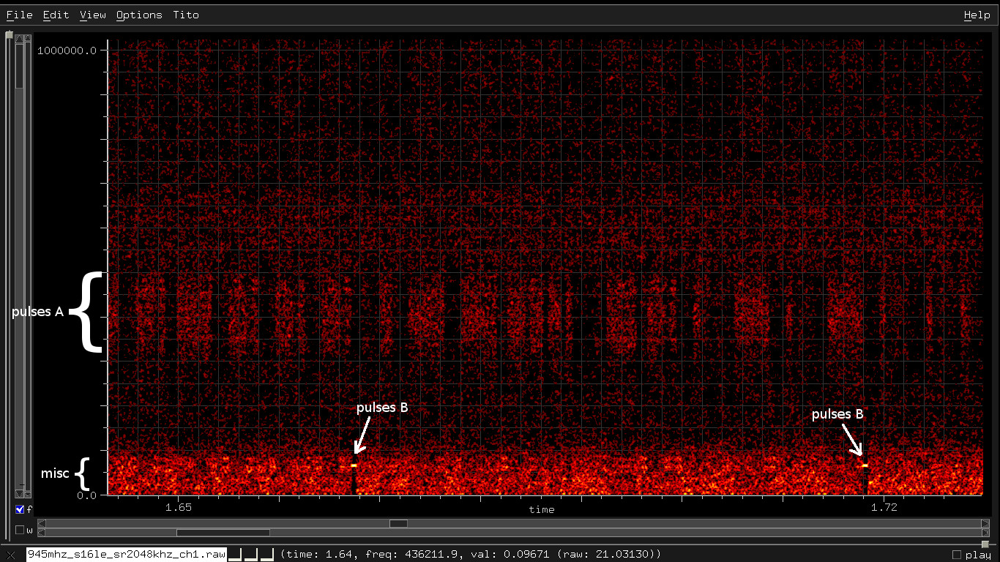

During the recording, the infamous criminals lower the level of the
voices and increase the noise. Recently, the level of the voices is
also very low if I don't record, however the intensity of the
induced [tinnitus](https://en.wikipedia.org/wiki/Tinnitus) is
unchanged.

A pulse "A" is the sum of 100 sinusoids separated by 1733 Hz, so the
bandwidth is 173.3 kHz.

```
1733.33 = 5200 / 3 = 50 * 8 * 13/3 = 650 * 8/3
```

A pulse "B" is the sum of 7 sinusoids separated by 216.6 Hz.

```
216.66667 = 650 / 3 = 5200 / 24 = 1733.33 / 8
```

Note: the frequencies 1733.33 Hz and 216.67 Hz can be mixed with the
harmonics of 50 Hz to get other harmonics of 50 Hz. It is important
because the whole attack exploits the electric current with nominal
frequency of 50 Hz.

```
sin(x+y) = sin(x)*cos(y) + cos(x)*sin(x)
sin(x-y) = sin(x)*cos(y) - cos(x)*sin(x)
sin(3*(x+y)) = 3 sin(x+y) - 4 (sin(x+y))^3

Examples:

sin(50) = sin(3*(650/3 - 200)) = 3 * sin(650/3 - 200) - 4 * (sin(650/3 - 200))^3

sin(100) = sin(3*(250 - 650/3)) = 3 * sin(250 - 650/3) - 4 * (sin(250 - 650/3))^3
```

The pattern of the the pulse repetition periods is

```
A A A A B A A A A B A A A A B ...

A = 0.0461 s = 80 / 1733  => 21.69 Hz
B = 0.0511 s = A + 1/200 = 75 / 1469  => 19.57 Hz
freq_average = 5 / ((A * 4) + B) = 21.23 Hz
```

This pattern is particularly sympathizing with the oscillation at the
nominal frequency of the electrical grid between 49 and 51 Hz:

```
A * 4 = 0.0461 * 4 = 0.184 = 9 cycles at 49 Hz
A * 4 + B = 5 * 0.0461 + 1/(50*4) = 0.235 = 12 cycles at 51 Hz
```

In practice, the pattern is made by 5 repetitions of A plus the
duration of a quarter cycle at 50 Hz. The next figure shows 10 seconds
of the absolute value of three oscillations at 49, 50 and 51 Hz
respectively, sampled by using the periods of that pattern.
The distribution and the modulation of the peaks remind the tremors
that I sometimes perceive.

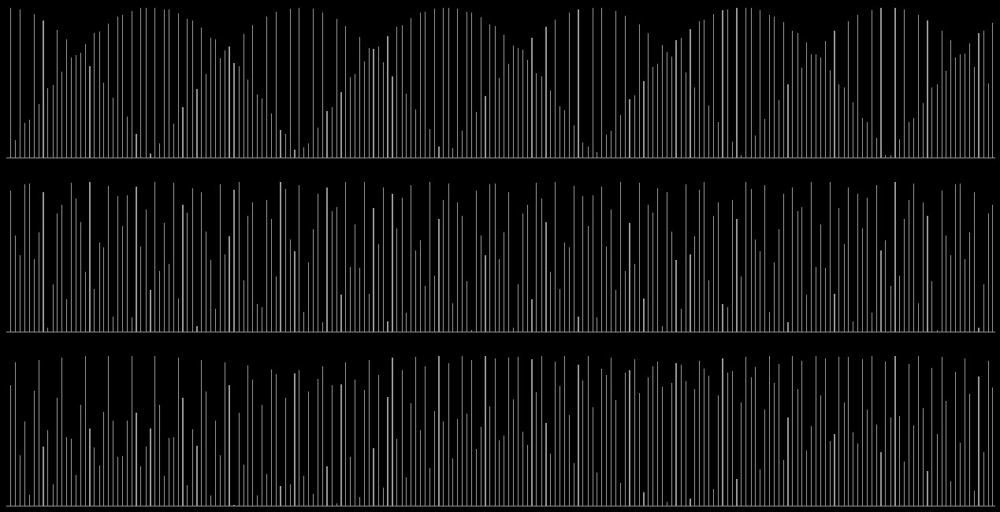

### Radiation sampling and aliasing

If I use my body as antenna by touching the receiving antenna with the
hand, I can record the pulses repeated with frequency of about 78250
Hz that could be caused by the SMPS (Switch Mode Power Supplies) of
the electric smart meter. Sometimes I have recorded pulses with
frequency 31300 Hz instead of 78250 Hz. The ratio 5/2 between these
frequencies is described in the section "Electric meters ACEA-ARETI
with oscillator at 939 MHz". These pulses allow the sampling of the
signal hidden into the overall radiation (diffuse and direct):

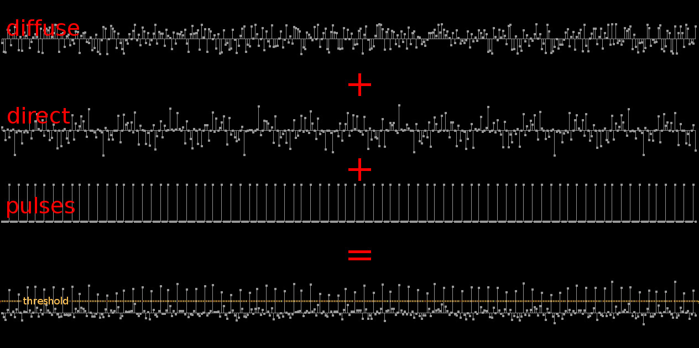

The direct radiation can also exploit some common signals that belong
to the diffuse radiation, for example the radio-tv stations, concealing
some partials in the same signal with inverted phase.

The samples of a sound sampled at 80 KHz (or 31.3 KHz) can be hidden
in the modulating signals. The absorbed impulsive radiation of 80 KHz
generates thermoelastic pulses that "sample" the overall signal
envelope (not just the signal at 945 MHz but also the other
components, some described in this document), causing the perception
of the sound. The domain is not digital, therefore the samples have a
duration at least equal to the pulse width.

In this case, it is difficult to correctly demodulate the hidden
signal and listen the sound, because the injected samples have to be
in phase with the electric current, just as the pulses at 80 KHz. The
trick used by the thugs to monitor the phases of the electric current
is described in a separated section (an infrasound obtained from a
signal at 422.733 MHz).

However, it is simplest to "sample" particular oscillations through
aliasing. For example, to get an oscillation of 100 Hz when the pulse
frequency is 78250 Hz, it is enough to transmit a signal with central
frequency of

```
78250 * N - 100
78250 * N + 100
```

where N is an integer greater than zero. The oscillations are

```
sin(2*pi*(78250*N-100)*t + pi - initial_phase)
sin(2*pi*(78250*N+100)*t + initial_phase)

Example: getting 100 Hz from about 700 MHz with intial phase pi/8

700024600 = 78250 * 8946 + 100
sin(2*pi*700024600*t + pi/8)

or:

700024400 = 78250 * 8946 - 100
sin(2*pi*700024400*t + 7/8 pi)
```

In the section "Audio recordings", there is a link to a sound file
that contains an oscillation of 5400 Hz recorded on August 20, 2018.
I have noticed that 5400 Hz can be obtained through the aliasing of
the "pulses A" if the sampling rate is 31.3 kHz. The following table
lists the frequencies obtainable through the aliasing of the
"pulses A" with sampling frequencies 31300 Hz and 78250 Hz:

```
31300 = 313 * 100
78250 = 313 * 250

313 is a prime number.
```

| sr = 31300 Hz | sr = 78250 Hz |
|---------------|---------------|
| 100           | 250           |
| 200           | 500           |
| 300           | 1233          |
| 400           | 1483          |
| 500           | 1733          |
| 1233          | 1983          |
| 1333          | 2233          |
| 1433          | 2967          |
| 1533          | 3217          |
| 1633          | 3467          |
| 1733          | 3717          |
| 1833          | 3967          |
| 1933          | 4700          |
| 2033          | 4950          |
| 2133          | 5200          |
| 2233          | 5450          |
| 2967          | 5700          |
| 3067          | 6433          |
| 3167          | 6683          |
| 3267          | 6933          |
| 3367          | 7183          |
| 3467          | 7433          |
| 3567          | 8167          |
| 3667          | 8417          |
| 3767          | 8667          |
| 3867          | 8917          |
| 3967          | 9167          |
| 4700          | 9900          |
| 4800          | 10150         |
| 4900          | 10400         |
| 5000          | 10650         |
| 5100          | 10900         |
| 5200          | 11633         |
| 5300          | 11883         |
| 5400          | 12133         |
| 5500          | 12383         |
| 5600          | 12633         |
| 5700          | 13367         |
| 6433          | 13617         |
| 6533          | 13867         |
| 6633          | 14117         |
| 6733          | 14367         |
| 6833          | 15100         |
| 6933          | 15350         |
| 7033          | 15600         |
| 7133          | 15850         |
| 7233          | 16100         |
| 7333          | 17083         |
| 7433          | 17333         |
| 8167          | 17583         |
| 8267          | 17833         |
| 8367          | 18817         |
| 8467          | 19067         |
| 8567          | 19317         |
| 8667          | 19567         |
| 8767          | 20550         |
| 8867          | 20800         |
| 8967          | 21050         |
| 9067          | 21300         |
| 9167          | 22283         |
| 9900          | 22533         |
| 10000         | 22783         |
| 10100         | 23033         |
| 10200         | 24017         |
| 10300         | 24267         |
| 10400         | 24517         |
| 10500         | 24767         |
| 10600         | 25750         |
| 10700         | 26000         |
| 10800         | 26250         |
| 10900         | 26500         |
| 11633         | 27483         |
| 11733         | 27733         |
| 11833         | 27983         |
| 11933         | 28233         |
| 12033         | 29217         |
| 12133         | 29467         |
| 12233         | 29717         |
| 12333         | 29967         |
| 12433         | 30950         |
| 12533         | 31200         |
| 12633         | 31450         |
| 13367         | 31700         |
| 13467         | 32683         |
| 13567         | 32933         |
| 13667         | 33183         |
| 13767         | 33433         |
| 13867         | 34417         |
| 13967         | 34667         |
| 14067         | 34917         |
| 14167         | 35167         |
| 14267         | 36150         |
| 14367         | 36400         |
| 15100         | 36650         |
| 15200         | 36900         |
| 15300         | 37883         |
| 15400         | 38133         |
| 15500         | 38383         |
| 15600         | 38633         |

### Tinnitus simulation

I have simulated the tinnitus produced by the pulses of the signal
received at 945 MHz by approximating the termo-acoustic demodulator
described in the section "Voice encoding":

[tinnitus_pulses.wav (View Raw)](https://raw.githubusercontent.com/titola/neuropa/master/media/tinnitus_pulses.wav)

[tinnitus_pulses.wav](https://github.com/titola/neuropa/blob/master/media/tinnitus_pulses.wav)

I have preferred to use a source-filter model instead of synthesizing
the acoustic frequencies, therefore the thermoelastic wave is approximated
by a pulse train with pattern A-A-A-A-B and average frequency of 21.23 Hz
(the other pulses are excluded to simplify the model) filtered by the
conduction filter based on the figure 4 in [4]. This type of signal
interferes in particular way with the neural oscillations (the other
variable pulses can modulate specific brain waves with different rhythms)
before to reach the inner ear.

It is possible to compute the induced pressure amplitude by using the
formula and the amplitude factors of the figure 4 in [4]:

```
P(pulse_width) = A*abs(sin(pi*freq*pulse_width)) =

= 572*abs(sin(pi*7800/(216.625*7))) = 2.49e-4 Pa (about 22 dB SPL)
```

where 7800 Hz is the main acoustic frequency.

The following audio file contains an annoying interval of minor sixth
between the simulated tinnitus at 21.2 Hz and an oscillation around 35.4 Hz
(the listening requires decent headphones):

[tinnitus_plus_6min.wav (View Raw)](https://raw.githubusercontent.com/titola/neuropa/master/media/tinnitus_plus_6min.wav)

[tinnitus_plus_6min.wav](https://github.com/titola/neuropa/blob/master/media/tinnitus_plus_6min.wav)

The example of the minor sixth is not casual but inspired by
some audio recordings that capture low frequency sounds and
infrasounds. The next clip is amplified by 40 dB:

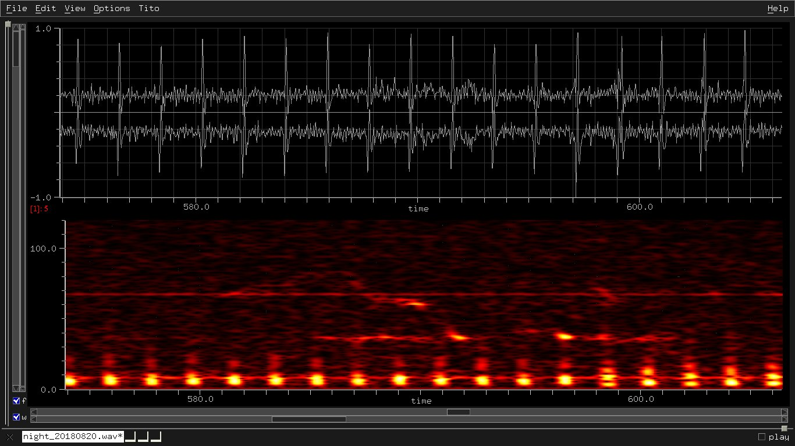

[low_freq_with_6min_for_tinnitus.wav](https://github.com/titola/neuropa/blob/master/media/low_freq_with_6min_for_tinnitus.wav)

The (protected) criminals use these sounds also to exploit the
interaction with the tinnitus. Some nightly audio recordings contain
the sounds produced through intentional electromagnetic interferences:
pulses repeated every 1.9 seconds, a continuous signal with fundamental
frequency of 7.62 Hz and other frequencies that form simple ratios with
50 Hz, the nominal frequency of the electrical grid in Italy [5], for
example:

```
100 = 50 * 2
66.6 = 50 * 4/3
216.6 = 50 * 13/3
50 = 96 / [repetition period of the peaks] = 96 / 1.92
50 = 9 / [pulse duration] = 9 / 0.18

sporadic "scintillant" errors:
  5415 = 216.6 * 25
```

### Pulses repeated in the modulating signal

Finally, the part labeled "misc" in the first sonogram contains pulses
produced by the sum of sinusoids separated by 1469 Hz and other
sinusoids also separated by 1469 Hz.

If I apply an envelope follower to the recorded I/Q, the result
contains again the harmonics of 1733 Hz:

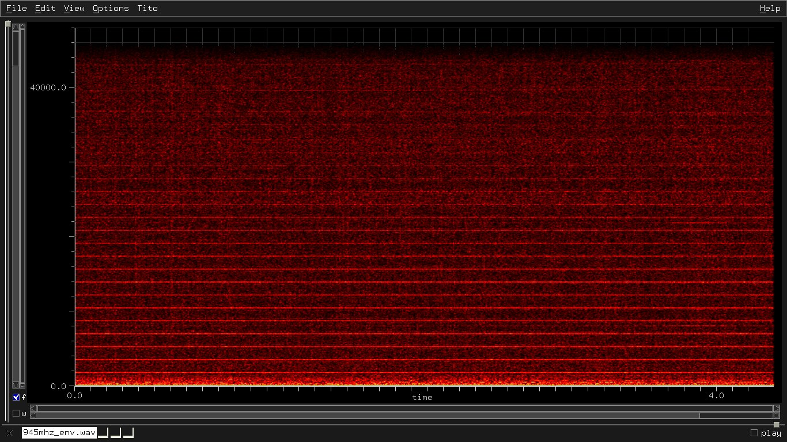

I continue to receive that and other malicious signals (at least)
from July 2017 thanks to the negligence of the Italian security forces
and Ministero della Difesa that should control the use of the radio
frequencies. Unfortunately, there aren't real professionals in North Rome.
If the attack is caused by foreign agencies and it is difficult to
stop for various reasons, the citizens should be informed. From the
Costituzione della Repubblica Italiana, articolo 28:

> I funzionari e i dipendenti dello Stato e degli enti pubblici sono
> direttamente responsabili, secondo le leggi penali, civili e
> amministrative, degli atti compiuti in violazione di diritti. In
> tali casi la responsabilità civile si estende allo Stato e agli enti
> pubblici.

Let me know if the Costituzione italiana that I have always respected
is still valid. Meanwhile, I have learned to humiliate these fanatic
idiots by controlling their sophisticated movements through a simple
game of mirrors.

## Voice encoding

The criminals use more techniques. The prior section "Signal directed
to the head" describes the sampling with aliasing through a pulse train.
The steps to transmit a signal to a termo-acoustic "sampler" are:

- STFT (Short Time Fourier Transform) to divide the signal into modulated sinusoids.

- Transmit these oscillations in scattered or arbitrary order (diffuse and/or direct radiation) with central frequencies obtained through aliasing.

- Send pulses through the electrical grid. The pulse frequency is equal to the sampling rate used to compute the central frequencies.

A recipe to get the pulses A is the following:

-   Sinusoidal signal with frequency 14.5 kHz, frequency modulated by a vocal sound.

-   Pulse generated each time the amplitude of the modulated signal goes from positive to negative.

The pulses are generated by the sum of sinusoids separated by the
frequencies that cause an unceasing resonant tinnitus in my head.

Any time the energy of a RF pulse is absorbed by the cerebral tissue,
the temperature rises of 5e-6 °C [6]. The rapid thermal expansion produces
a thermoelastic wave that travels to the inner ear. Therefore the
criminals use that thermo-acoustic demodulator to send vocal messages
to me through ultrasounds.

This information defuses the psychologic weapon because it cancels the
suggestive effect. The childish effect "play the entryphone and run
away" and the annoying side effects (to describe in a separate section)
persist.

I still have to analyze another technique that use the plasma and the
electric current. The system used against me outdoors is similar to the
weapon described in this page:

[Scalable Compact Ultra-short Pulse Laser Systems (SCUPLS)](https://www.sbir.gov/sbirsearch/detail/1508927)

If it allows the listening of more spatialized voices and sound samples,
then it is the same weapon or an imitation (imagine to have invisible
headphones with 3D binaural audio effect).

## Harmonics of 50 Hz from the mix of the amplitude modulations

Also my neighbors receive this type of signal:


It is nervous and tries to obscure its intentions. Often, it is
coupled with an attenuated imitation about 91.2 kHz apart.

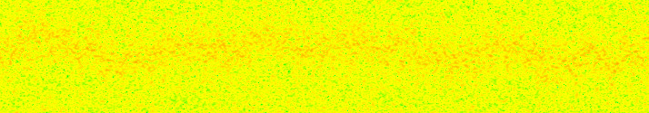

On July 18th 2018, I have counted about 45 components of this type,
5 between 80 and 88 MHz and at least 40 between 120 and 170 MHz.

The autocorrelation of the envelope reveals the signature of the sender:
resonances multiple of about 1740 Hz and a pulse train with frequency of
about 18 Hz and bandwidth less than 1600 Hz. The envelope also contains
a strong isolated oscillation with frequency around 20 kHz.

Example: center frequency of 138 MHz

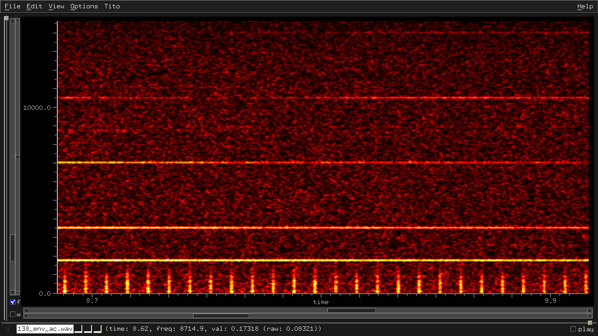

Other examples:

[fc 160 MHz](https://github.com/titola/neuropa/blob/master/media/160_env_ac.jpg)

[fc 170 MHz](https://github.com/titola/neuropa/blob/master/media/170_env_ac.jpg)

I have analyzed the whole envelope of the recorded I/Q with sampling
rate of 2.4 MHz, considering all the carrier frequencies within the
band of 1.2 MHz and the result is surprising:

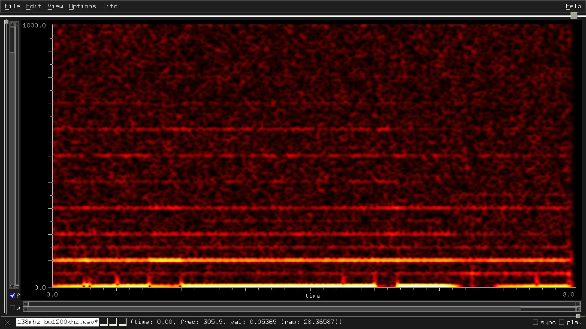

The oscillations are multiple of the nominal frequency of 50 Hz and
the highest harmonic is of 100 Hz. I have repeated the measure by
applying a high pass filter to remove the first 50 kHz and the result
is the same.

The autocorrelation highlights the harmonics:

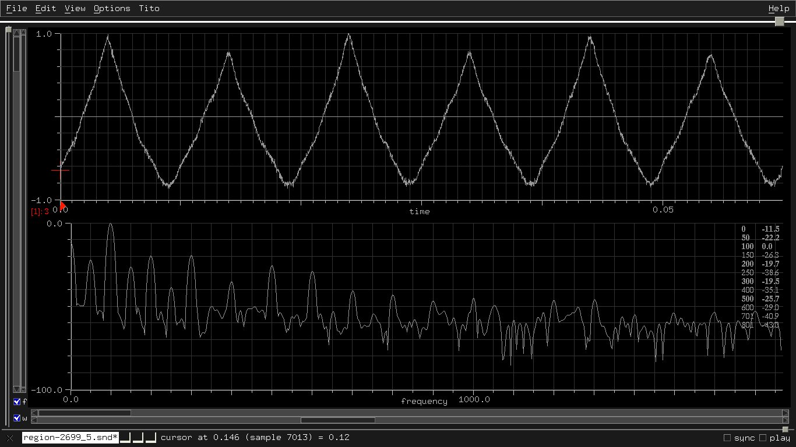

Therefore there are hundreds of carrier frequencies with modulations
that hide their intent: harmonic frequencies of 50 Hz resulting from
the mix of the amplitude modulations. The related currents induced
into the circuits that pass through a rectifier and an amplifier,
particularly the radio modules of the smart electric meters, dirty
the electric current in a particular and possibly controlled way.

## Hypothesis about the US embassy attack in Cuba

The recording of what some US embassy workers heard in Havana has
characteristics similar to the signal at 945MHz that I receive in my
head. The main difference is the distance in frequency between the
sinusoids that generate the pulses. In my case:

-   Pulses with sinusoids separated by 216.6 Hz and pulse repetition periods with A-A-A-A-B (see above).

-   Pulses with sinusoids separated by 1733 Hz and variable pulse repetition period.

In the Cuban case, the sinusoids are always separated by 180 Hz but
the 21 Hz clock is the same.

The amplitudes of the following sonogram are in dB to highlight the
part filtered by the recorder or by the editor:

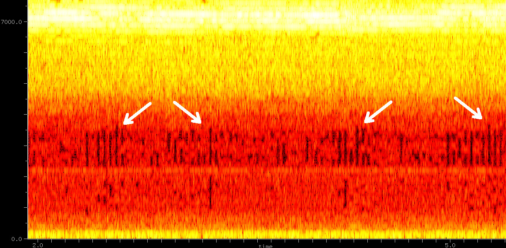

Instead, the next sonogram shows the clock in my head (linear amplitude)
under 1733 Hz, demodulated, under-sampled and recorded to a sound file:

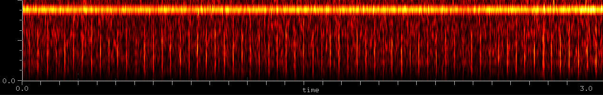

There are two types of pulse:

-   Pulses with sinusoids separated by 180 Hz, bandwidth of 3960 Hz and pulse frequency of 21 Hz.

-   Pulses with sinusoids separated by 180 Hz and variable pulse repetition period.

### Harmonics of 180 Hz through aliasing

If the system is the same used against me, the pulses from the
electrical grid, for example with frequency

```
56340 = 313 * 180
```

"sample" the harmonic frequencies of 180 Hz through aliasing (see
the previous section "Signal directed to the head" to understand
the radiation sampling). For example, the aliasing of 157 sinusoids
separated by 1800=5400/3 Hz (instead of 1733=5200/3) starting from
943.695e6 MHz, results all the frequencies multiple of 180 Hz from
180 to 28080. In the general case:

```
157 sinusoids separated by 180 * N, with N positive integer.
157 = (56340/180 + 1)/2
```

In this case the magic ratio should be 3/2 instead of 5/2
(or 3 if the inferior frequency is 18780 Hz):

```
# 60 Hz is the nominal frequency of the electrical grid in Cuba.
18780 = 313 * 60
37560 = 313 * 120
56340 = 313 * 60 * 3 = 313 * 120 * 3/2
```

The overall attack should be based on the ratio 3/2 (or 3).
For example, if the radio module receives at 169 MHz, the signal that
generates the infrasound is about 253.5 MHz (or 507 MHz if the ratio
is 3).

Note: with the prime number 433, the pulse frequency 77940 Hz is
near 78250 Hz:

```
433 * 60 = 25980
433 * 120 = 51960
433 * 60 * 3 = 433 * 120 * 3/2 = 77940
```

During an electromagnetic phenomenon, a flow of spins obtained from
these pulses could have generated the sound.

### Methods to get the voices from the audio recording

-   FIR filter to select the content between 6 and 9 kHz.

-   Pitch 1 octave up (optional).

    ```
    # example
    rubberband -f2 in.wav out.wav
    ```

-   Slope detector.

    ```
    pseudo-code: env_follower(diff(input))
    ```

-   BP filter to select the content between 100Hz and 3.5kHz.

[cuba_attack_decoded.ogg (View Raw)](https://raw.githubusercontent.com/titola/neuropa/master/media/cuba_attack_decoded.ogg)

[cuba_attack_decoded.ogg](https://github.com/titola/neuropa/blob/master/media/cuba_attack_decoded.ogg)

Alternative method:

-   FIR filter to select the content between 6 and 9 kHz.

-   Convolution of a set of impulses with a FIR BP, fmin=100Hz and fmax=3kHz.

    ```
    # pseudo-code to generate the set of impulses

    d[n] = in[n] - in[n-1]
    if d[n] < 0 and d[n-1] >= 0
        then out[n] = in[n-1]
        else out[n] = 0
    endif
    ```

[cuba_attack_decoded_alt.ogg (View Raw)](https://raw.githubusercontent.com/titola/neuropa/master/media/cuba_attack_decoded_alt.ogg)

[cuba_attack_decoded_alt.ogg](https://github.com/titola/neuropa/blob/master/media/cuba_attack_decoded_alt.ogg)

## Other signals to analyse

### Events synchronized with the voices

This type of signal is synchronized with the voices:

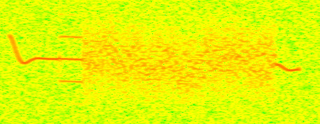

Received at the frequencies 173.456 MHz, 173.880 MHz, 173.956 MHz and
460.557 MHz with bandwidth of 4 kHz.

The hook shaped curve remembers the PLHR (Power Line Harmonic Radiation)
induction lines described in the paper "On the nonlinear triggering of
VLF emissions by power line harmonic radiation" by D. Nunn, J. Manninen,
T. Turunen, V. Trakhtengerts and N. Erokhin.

A sinusoidal signal goes down from the maximum to the central
frequency and continues with duration between 0.072 and 0.076 seconds,
then it is amplitude modulated by a sinusoid of 2 kHz (mix of two side
sinusoids) for 0.034 seconds. The middle part is a kind of noise with
LTAS (Long-Term Average Spectrum) almost uniform in bandwidth:

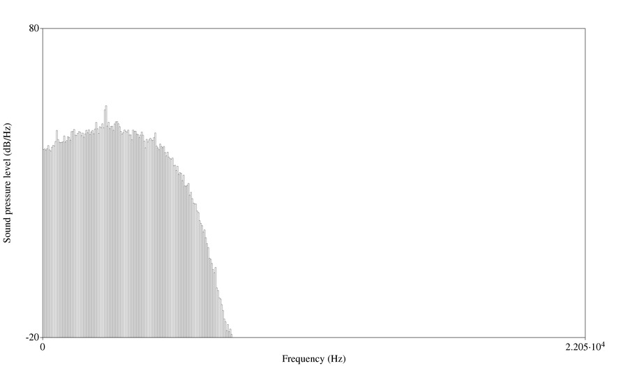

The duration of the final sinusoidal signal is about 0.034 seconds.

The duration of the noisy part (maybe a cloud of sinusoidal gains)
depends on the perceived voice.

### Correspondence between 422.733 MHz and infrasounds

The following signal is similar but with duration of 0.178 seconds,
repeated every 1.92 seconds

```
# 96 cycles of the nominal frequency of the electrical grid
1.92 = 96 / 50

# 9 cycles
0.18 = 9 / 50

# Values of the pulse frequency, 78250 Hz and 31300 Hz, obtained
# by multiplying 96/50 by some prime numbers.
96/50 * 5 * 3 * 11 * 13 * 19 = 1.92 * 40755 = 78250
96/50 * 2 * 3 * 11 * 13 * 19 = 1.92 * 16302 = 31300
```

and without isolated sinusoidal signals:

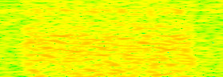

Received at the frequencies 421.684 MHz (bw 5kHz instead of 4kHz) and
422.733 MHz (bw 3kHz instead of 4kHz).

Note the duration of 0.178 seconds and the repetition period of 1.92
seconds in the audio recordings that contain low frequency sounds
and infrasounds:


[low_freq_with_6min_for_tinnitus.wav](https://github.com/titola/neuropa/blob/master/media/low_freq_with_6min_for_tinnitus.wav)

I think the thugs monitor the peaks of the infrasounds repeated every
1.92 seconds also to take the variation of the nominal frequency to
tune the signals, for example the duration between 9/49 (0.183s) and
9/51 (0.176s).

The formula:

```
y = x^2 * sin(2 pi 1/0.18 t)
```

is a first approximation of the transfer function to get the peaks of the
infrasound from the signal at 422.733 MHz. The frequency is 1/0.18 because
the tested signal was demodulated before to save it to a file. In fact,
the demodulation occurs within the smart electric meter, 2/5 of the input,
then the signal is induced into the circuit with the oscillator strangely
set to 938.889 MHz (instead of 868 MHz).

```
169 / 0.18 = 938.889 MHz
```

See the section "Electric meters ACEA-ARETI with oscillator at 939 MHz"
for more details.

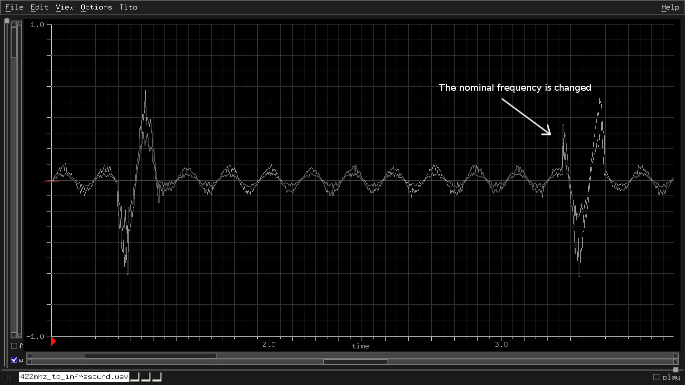

The other signals are transformed at least in low frequency oscillations.

Note: 421.684 MHz is not present in a recording on August 23th 2018,
and the bandwidth at 422.733 MHz becomes 5kHz. The comparison will be
useful to understand better the synthesis and the function of the low
frequency audio signal.

The following figure displays the autocorrelation of the envelope at
422.733 MHz, with the main frequencies:

```
20 Hz = 50 * 2/5

213.6 Hz near 216.6 Hz previously analyzed and dependent on the
nominal frequency: 216.6 = 50 * 13/3

2/5 * 422.733 = 169 MHz
(see the next section about the electric meters ACEA/ARETI).

2/5 * 50 = 20 Hz (main freq of the envelope at 422.733 MHz).

5 * 173.7 = 868 MHz (electric meters).

5 * 42.72 = 213.6 (another main freq of the envelope at 422.733 MHz).
where 42.72 Hz is -2.8 dB under 213.6 Hz.
```

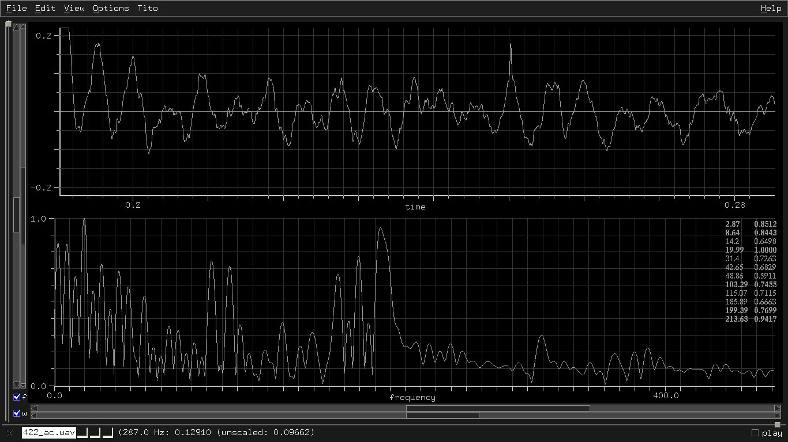

### Electric meters ACEA-ARETI with oscillator at 939 MHz

The smart electric meters of ACEA/ARETI should communicate in RF
at the frequencies 169 and 868 MHz. These frequencies are multiple of
some frequencies used for the attack (see the previous section):

```
868 / 5 = 173.6
    => 173.4 and 173.7 MHz are synchronized to the voices.

169 * 5/2 = 422.5
    => 421.684 and 422.7 MHz are synchronized to the infrasounds.
```

From "Bilancio di Sostenibilità 2017 del Gruppo Acea", pag. 81:

> È stato poi avviato lo sviluppo di un concentratore multiservizio
> per i contatori elettronici di prima generazione adeguatamente
> reingegnerizzato, predisposto per l’acquisizione dei contatori di
> seconda generazione e per essere integrato con una terza unità
> per la comunicazione in RF a 169/868 MHz. Il nuovo concentratore
> multiservizio (CMS) è un apparato di tipo modulare costituito da
> un’unità centrale di controllo ed elaborazione e una o più unità
> aggiuntive ognuna dedicata a un servizio specifico (elettrico,
> idrico, ecc.). A fine dicembre 2017 è stato presentato il
> prototipo che sarà oggetto delle prove e dei collaudi nel corso
> della prima metà del 2018.

By analysing the infrasound described in the prior sections, I have
discovered that an oscillator has the frequency set at 939 MHz instead
of the declared 868 MHz. You can notice that the RF signals near 939 MHz
are really the responsables of the tinnitus.

It is interesting to notice the ratio between that frequency and the
frequencies 78250 Hz and 31300 Hz of the recorded pulses, probably
induced by the SMPS (Switch Mode Power Supplies):

```
939000000 / 78250 = 12000
939000000 / 31300 = 30000
78250 / 31300 = 5/2
```

12000 or 30000 cycles at 939 MHz between two pulses. Besides, the
ratio 5/2 between the two frequencies is equal to the ratio between
422.733 MHz and 169 MHz.

Why 1/0.18, the reciprocal of 9 cycles of the nominal frequency of the
electrical grid? The oscillators of the smart meter are in phase
with the provided electric current, therefore:

```
169 / 868 = 0.19470046
mod(0.19470046, 1/50) = 0.014700472
0.19470046 - 0.014700472 = 0.18 = 9 / 50
169 / 0.18 = 938.889 MHz instead of 868 MHz
```

If the oscillator is settable, it is so especially for the thugs.
In this case, the following table lists some frequency bands usable
based on the frequency of the first oscillator at 169 MHz and the
number of the cycles of the nominal frequency between 49 and 51 Hz:

| cycles | freq min (MHz) | freq max (MHz) |
|--------|----------------|----------------|
| 50     | 165.4          | 172.4          |
| 49     | 169.0          | 175.9          |
| 48     | 172.5          | 179.6          |
| 47     | 176.2          | 183.4          |
| 46     | 180.0          | 187.4          |
| 45     | 184.0          | 191.5          |
| 44     | 188.2          | 195.9          |
| 43     | 192.6          | 200.4          |
| 42     | 197.2          | 205.2          |
| 41     | 202.0          | 210.2          |
| 40     | 207.0          | 215.5          |
| 39     | 212.3          | 221.0          |
| 38     | 217.9          | 226.8          |
| 37     | 223.8          | 232.9          |
| 36     | 230.0          | 239.4          |
| 35     | 236.6          | 246.2          |
| 34     | 243.5          | 253.5          |
| 33     | 250.9          | 261.2          |
| 32     | 258.8          | 269.3          |
| 31     | 267.1          | 278.0          |
| 30     | 276.0          | 287.3          |
| 29     | 285.5          | 297.2          |
| 28     | 295.7          | 307.8          |
| 27     | 306.7          | 319.2          |
| 26     | 318.5          | 331.5          |
| 25     | 331.2          | 344.7          |
| 24     | 345            | 359.1          |
| 23     | 360.0          | 374.7          |
| 22     | 376.4          | 391.8          |
| 21     | 394.3          | 410.4          |
| 20     | 414            | 430.9          |
| 19     | 435.8          | 453.6          |
| 18     | 460            | 478.8          |
| 17     | 487.1          | 507            |
| 16     | 517.6          | 538.7          |
| 15     | 552            | 574.6          |
| 14     | 591.5          | 615.6          |
| 13     | 637            | 663            |
| 12     | 690.1          | 718.2          |
| 11     | 752.8          | 783.5          |
| 10     | 828.1          | 861.9          |
| 9      | 920.1          | 957.7          |
| 8      | 1035.1         | 1077.4         |
| 7      | 1183           | 1231.3         |
| 6      | 1380.2         | 1436.5         |
| 5      | 1656.2         | 1723.8         |
| 4      | 2070.2         | 2154.7         |


Therefore the signal directed to my head at 945 MHz (also 935 MHz and
461 MHz, but there is other) is possibly repeated by the ACEA's smart
meters. I hope no, but if the thugs control the distribution of the
RF signals of all the deficient meters, they can mix and direct them to
a specific zone.

### Frequency of 3.7 GHz and 5G testing

The frequency band of 929.6-970 MHz includes more signals directed to
my head. The signal level is high around the frequencies 930 MHz,
935.575 MHz, 937.592 MHz, 938.775 MHz, 940.567 MHz, 941.164 MHz,
942.570 MHz, 944.781 MHz, 945 MHz (analyzed) and 960 MHz.

Perhaps it is a coincidence, but if we multiply the frequency band
929.6-970 MHz by four

```
3.718 GHz = 4 * 929.6 MHz
3.780 GHz = 4 * 945.0 MHz
3.880 GHz = 4 * 970.0 MHz
```

we get a band width of about 160 MHz starting from about 3.7 GHz.
160 MHz should correspond to the two upper lots of 80 MHz of the
frequency band 3.6-3.8 GHz, that it is assigned to Telecom Italia
(specific block 80 MHz), Vodafone Italia (generic block 80 MHz),
Wind Tre (generic block 20 MHz) and Iliad Italia (generic block
20 MHz).

[Conclusa la GARA 5G (sviluppoeconomico.gov.it)](https://www.sviluppoeconomico.gov.it/index.php/it/194-comunicati-stampa/2038666-gara-5g)

The coincidences are more than one:

```
422.733 MHz * 9 = 169 MHz * 9 * 5/2 = 3.8 GHz
169 MHz * 5/2 * 7 * 9 = 26.6 GHz
```

5/2 is the usual magic number and 26.6 GHz belongs to the frequency
band 26.5-27.5 GHz for 5G with wavelengths of about 11 millimeters.

I'm curious to know the ratio between the downlink frequency and
the uplink frequency used in Vodafone Italia and Huawei tests.
It is also interesting to know the details about the security risks
of the Huawei technology, suddenly repudiated by several countries
but used in Italy also by ACEA:

[Rinnovata l’intesa tecnologica fra Acea e Huawei (www.gruppo.acea.it)](https://www.gruppo.acea.it/it/gruppo/comunicato?idComunicato=/2018/11/rinnovata-l-intesa-tecnologica-fra-acea-e-huawei&resource=/content/aceacorporate/it/home/media-eventi/news-comunicati-stampa.html&title=Rinnovata%20l%27intesa%20tecnologica%20%20fra%20Acea%20e%20Huawei)

There is also...

> Progetto di videosorveglianza aerea basato sull’utilizzo di droni,
> realizzato in collaborazione con Intellitronika, Politecnico di Milano,
> Huawei, la Polizia Locale e Italdron [...]

<http://hi-tech.leonardo.it/5g-vodafone-huawei-drone-sicurezza/>

> soluzioni tecnologiche avanzate per le forze dell’ordine e per la
> sicurezza civile e militare [...]

I'm sorry, but you are no more credible nor reliable.

### Body vibration stopped after some nightly explosions

On October 2 2018 night, my body has started to rapidly vibrate with a
growing intensity. After a hasty sequence of at least three explosions
(I haven't checked on the time), the vibration intensity is attenuated
about 70%.

On January 12 2019 at 4:15 a.m., another similar but less strong
explosion has marked the end of a slight body vibration, started after
one of the many forced awakenings.

The sound that I hear during the body vibrations remembers the sound
of a concrete mixer.

On January 16 2019 at midnight: no explosions but an instantaneous
flash has lighted up my room during a forced awakening. It is the
first time that it occurs, therefore I will add the date of other
similar events. Then the torture is continued with the body heating
for some hours (it is instead a classic) and the customary voices
that provoke me nonstop. Sometimes the walls creak as every night.
Generally the forced awakenings are more than three.

I don't take medicines or drugs and fortunately my brain is still
efficient. I will discover who are these ridiculous militarized
stupids and I will humiliate who protect them.

### Beat between impulsive radiation and military VLF

The pulses obtained from sinusoids separated by 5200/3 or 1733 Hz
create a particular beat with 20760 Hz, the VLF (Very Low Frequency)
transmitted from the antennas of Tavolara Island (Sardinia, Italy):

<https://en.wikipedia.org/wiki/List_of_VLF-transmitters>

<https://en.wikipedia.org/wiki/Tavolara_Island>

<http://www.lanuovasardegna.it/sassari/cronaca/2013/05/11/news/aerei-robot-radar-e-satelliti-le-nuove-servitu-1.7043405>

5200 is the third harmonic of 5200/3 Hz and corresponds to the musical
interval of perfect fifth, one octave up. The twelfth harmonic of 20800 Hz
is again a perfect fifth but three octaves up.

```
5200/3 * 12 = 20800 Hz    ; perfect fifth, 3 octaves up => 12/8 = 3/2
650/3 * 96 = 20800 Hz     ; perfect fifth, 6 octaves up => 96/64 = 3/2
20800 - 20760 = 40 Hz     ; beat
50 / 40 = 5/4             ; major third
100 / 40 = 5/2            ; major third, 1 octave up (major 10th)
```

The musical interval between 50 Hz and the beat of 40 Hz is the major
third, whereas that between 100 Hz and 40 Hz is the major 10th (major
third one octave up). 100/40 is equal to 5/2, the magic number of the
whole attack.

There is also a particular ratio between 20760 Hz and the pulses with
pattern A-A-A-A-B analysed in the section "Signal directed to the head":

```
20760 / (3 * 11 * 29) = 21.69 Hz
```

20760 Hz also works good with the nominal frequency of 60 Hz,
creating a beat of 60 Hz with the 115th harmonic of 180 Hz:

```
180 * 115 = 60 * 3 * 5 * 23 = 20700 Hz
20760 - 20700 = 60 Hz
```

Besides, if the relation between the frequency 3.78 GHz of the new
frequency band for 5G and 945 MHz involves the pulses generated by
harmonics of 20800/3 Hz,

```
3.78 GHz = 4 * 945.0 MHz
20800/3 = 6933 = 4 * 5200/3 MHz
```

also the third harmonic of the impulsive modulation at 3.78 GHz
generates a beat of 40 Hz with 20760 Hz.

I don't playing with the numbers, the amplitude modulation around
20800 Hz is present in the radiation recordings, for example:

[hum_20180911_part1.wav](https://github.com/titola/neuropa/blob/master/media/hum_20180911_part1.wav)

[hum_20180911_part2.wav](https://github.com/titola/neuropa/blob/master/media/hum_20180911_part2.wav)

The radiation is recorded connecting an antenna to the PC soundcard.
In the second recording I have used my body as antenna, touching
a jack connected to the PC soundcard.

If we apply a selective high pass filter with cut frequency of 10 kHz
and normalize the result, we can notice the formant at about 20800 Hz.
There are also formants around 17900 Hz and 12000 Hz.

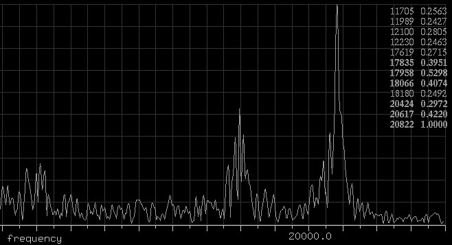

If we demodulate the filtered sound, we get frequencies multiple of 50 Hz
and an isolated formant around 6400 Hz:


Finally, it is interesting to notice the location of Havana (Cuba),
Rome (Italy), Tavolara (Sardinia, Italy) and Guǎngzhōu (China)
on the map of the geomagnetic latitudes:

<https://spawx.nwra.com/spawx/maps/maplats.html>

## Audio recordings

### Oscillation of 5400 Hz after an induced convulsion

I have heard an oscillation of 5400 Hz only one time, the night on
August 20, 2018. I profoundly breathe after one of the many nightly
induced convulsions. The oscillation starts with the peak of the
infrasound.

[5400hz_20180820_night.wav (View Raw)](https://raw.githubusercontent.com/titola/neuropa/master/media/5400hz_20180820_night.wav)

[5400hz_20180820_night.wav](https://github.com/titola/neuropa/blob/master/media/5400hz_20180820_night.wav)

### Interval of minor sixth with the tinnitus

An annoying interval of minor sixth between the induced tinnitus and
an oscillation of about 35.4 Hz.

[low_freq_with_6min_for_tinnitus.wav (View Raw)](https://raw.githubusercontent.com/titola/neuropa/master/media/low_freq_with_6min_for_tinnitus.wav)

[low_freq_with_6min_for_tinnitus.wav](https://github.com/titola/neuropa/blob/master/media/low_freq_with_6min_for_tinnitus.wav)

### Amplitude modulated oscillation of 100 Hz

Recorded on August 10, 2018.

There is a main entrance that communicates with five rooms. An amplitude
modulated oscillation with frequency of 100 Hz starts every time I go
into the entrance. The sound terminates if I go into a room. It is useless
to comment, they are idiots with the pedigree.

I have done more recordings by setting up the microphone in every room.
The following sound files are regions normalized and low pass filtered to
remove the environmental sounds. There are also some very low frequencies
to analyse.

(The game is suspended).

[Room A (View Raw)](https://raw.githubusercontent.com/titola/neuropa/master/media/100hz_room_a.wav)

[Room A](https://github.com/titola/neuropa/blob/master/media/100hz_room_a.wav)

[Room B (View Raw)](https://raw.githubusercontent.com/titola/neuropa/master/media/100hz_room_b.wav)

[Room B](https://github.com/titola/neuropa/blob/master/media/100hz_room_b.wav)

[Room C (View Raw)](https://raw.githubusercontent.com/titola/neuropa/master/media/100hz_room_c.wav)

[Room C](https://github.com/titola/neuropa/blob/master/media/100hz_room_c.wav)

[Entrance (View Raw)](https://raw.githubusercontent.com/titola/neuropa/master/media/100hz_entrance.wav)

[Entrance](https://github.com/titola/neuropa/blob/master/media/100hz_entrance.wav)

## References

[1] Costituzione della Repubblica Italiana, articolo 13.

[2] Josh Lederman and Michael Weissenstein. Dangerous sound?
What Americans heard in Cuba attacks. AP News, October 2017.

[3] Hang Chen, Xiaolong Fan, Hengan Zhou, Wenxi Wang, Y. S. Gui,
C.-M. Hu, and Desheng Xue. Spin rectification enabled by anomalous
Hall effect.

[4] N. M. Yitzhak, R. Ruppin, R. Hareuveny. Numerical Analysis of the
Microwave Auditory Effect.

[5] Coincidences: a three phase meter broken the last year during the
first attack and another electric meter unusable a few months ago
(pulled wires). Besides, if I switch off an electric meter, the intensity
of the body vibrations of the nightly tortures decreases.

[6] J.A. Elder and C.K. Chou. Auditory Response to Pulsed
Radiofrequency Energy.
